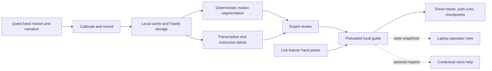

# Trail

**Record a physical task once. Follow the expert's movements in your own workspace, at your own pace.**

Trail is a planned mixed-reality physical-skill tutor for **Meta Quest 3S**,
developed for Hack the North 2026. An expert demonstrates a short task with
narration. Trail turns the recording into a reviewed tutorial, then guides a
different person with articulated ghost hands, spatial path cues, and movement
checkpoints aligned to their workspace.

**Current status:** runnable local application scaffold (the software portion of
TRAIL-02). The workspace includes a synthetic Three.js hand replay, recording
schemas, rigid transforms, a Fastify health route, unit/browser checks, and CI.
Recording, calibration, learner progression, persistence, live AI, pairing, and
headset validation remain planned. The experience below describes the target
product; the current screen is a diagnostic fixture.

## The experience

1. **Record.** The expert calibrates a marked mat, then performs and narrates a
   short task. Hand motion and audio share one recording timeline.
2. **Review.** Trail proposes movement boundaries and instruction labels. The
   expert adjusts the steps, active hand, and motion gates before saving the
   tutorial. Explicit markers provide a recovery path for authoring.
3. **Transfer.** A learner resets the parts and independently calibrates the
   same mat. The tutorial is preloaded onto the headset.
4. **Follow.** A translucent articulated ghost demonstrates each movement.
   Guidance responds to the learner's progress through the required motion
   gates and waits for a valid checkpoint hold before advancing.
5. **Recover and ask.** Repeat, Pause, and Help remain accessible. Contextual
   push-to-talk answers use the approved instructions; the local guide continues
   if AI or the server disconnects after preload.

The first demonstration uses four large, lightweight pieces on a rigid
50 × 35 cm mat: place a base, insert a support, add a crosspiece, and fit a cap.
Both people use the same layout and dominant hand. Three marks establish the
workspace; a fourth independently checks alignment.

Trail provides **spatial motion guidance**. “Movement checkpoint reached” means
the tracked hand satisfied the configured movement conditions. It does not
verify that an object was grasped or assembled correctly.

## Target architecture



| Layer | Planned technology and responsibility |
| --- | --- |
| Headset and desktop UI | TypeScript, Vite, HTML/CSS, Three.js, WebXR in Meta Browser |
| Shared contracts | Zod schemas and inferred TypeScript types |
| Motion runtime | Pure TypeScript transforms, segmentation, ordered gates, and guide reducer |
| Backend | One Fastify process for uploads, storage, jobs, AI, and WebSocket relay |
| Persistence | Local files on the demo laptop and browser IndexedDB |
| AI | OpenAI transcription, structured instruction labels, and contextual help |
| Verification | Vitest, Fastify API tests, Playwright desktop flows, and separate headset trials |

The browser owns progression. AI supplies semantics, never authoritative spatial
coordinates or permission to advance a step. Shared motion logic receives time
and observations explicitly; rendering, network, audio, and hardware stay in
adapters. Calibration belongs to the current XR session and must be repeated
after a reference-space reset or session restart.

WebXR is the planned runtime. A native alternative is considered only if a
measured browser limitation blocks a required core capability and a bounded
native proof demonstrates a viable improvement.

## Repository map

Available now:

- [plan.md](docs/plan.md) — product scope, contracts, algorithms, build sequence, and acceptance criteria.
- [AGENTS.md](AGENTS.md) — coding conventions, package boundaries, and agent workflow index.
- [.agents/skills/workflow/](.agents/skills/workflow/) — commit, PR, review, cleanup, verification, and QA skills.
- [.agents/references/validation.md](.agents/references/validation.md) — guidance for selecting and reporting evidence.

Application layout (module responsibilities beyond the scaffold remain planned):

```text
apps/web/             XR, recording, guidance, replay, review, and spectator UI
apps/server/          Fastify routes, storage, AI, and session relay
packages/contracts/  Versioned schemas and shared types
packages/motion/     Pure calibration, segmentation, and progression logic
fixtures/            Synthetic and explicitly approved real test recordings
tests/e2e/           Desktop browser acceptance flows
docs/                Device checks, contracts, demo instructions, and validation
data/                Private local recordings and generated assets; ignored by Git
```

## Development setup

Use Node **22.23.1** (see `.node-version`) and pnpm **11.3.0**. The dependency
versions are pinned exactly in the package manifests and one `pnpm-lock.yaml`.

```sh
pnpm install --frozen-lockfile
cp .env.example .env
pnpm dev
```

Open `http://localhost:5173`. The synthetic fixture supports Play/Pause, Reset,
keyboard scrubbing, and an explicit tracking gap. It is diagnostic joint replay,
not live capture, an articulated hand mesh, or learner progression.

Vite binds to `127.0.0.1:5173` with a fixed port and proxies `/api` and `/ws` to
Fastify on `127.0.0.1:3001`. Only `/api/health` is implemented; the `/ws` proxy
reserves the future relay path. In the scaffold, keep `PORT=3001` for development.
Server startup loads the root `.env` regardless of the package working directory;
existing process environment values take precedence. Relative `DATA_DIR` paths
resolve from the repository root. No credentials are required. Unsupported live
AI/haptic modes fail configuration validation instead of reporting mock success.
Provider keys must never enter `VITE_*` variables or client bundles.

For separate web and server terminals, first run `pnpm build:shared`, then:

```sh
# Terminal 1: shared package watchers and web
pnpm exec concurrently -k "pnpm dev:shared" "pnpm --filter @trail/web dev"
# Terminal 2: API
pnpm --filter @trail/server dev
```

| Command | Purpose |
| --- | --- |
| `pnpm dev` | Build shared packages, then start shared/web/server watchers |
| `pnpm check` | Strict typecheck (including tests/config), unit tests, production build |
| `pnpm test` | Contract, pure motion, architecture boundary, and Fastify checks; build shared packages first |
| `pnpm validate:fixtures` | Build shared packages and validate the committed synthetic recording |
| `pnpm test:e2e` | Test the **built** application on port 3101; run `pnpm build` or `pnpm check` first |
| `pnpm build` | Build shared ESM/declarations, web assets, and server |
| `pnpm start` | Serve built assets and API together on `http://localhost:3001` |

Install the browser once before desktop end-to-end tests:

```sh
pnpm exec playwright install chromium
pnpm check
pnpm test:e2e
```

CI installs Chromium with its Linux dependencies, runs the same checks, and
retains failure traces. No secrets or headset are needed. See
[scaffold notes](docs/scaffold.md) for module entry points, scope, and evidence;
[contracts](docs/contracts.md) describes the implemented subset and version policy.

### Quest connection

The confirmed hardware is a **Meta Quest 3S with controllers**. Installed OS and
Browser versions, hand-tracking behavior, and application compatibility still
need device validation. Controllers support setup and recovery; they do not
provide a bare-hand skeleton.

The following wired connection procedure is **not yet verified on a headset**:

1. Enable developer mode, connect a data-capable USB cable, and accept the
   headset's debugging prompt. Install Android platform tools or Meta Quest
   Developer Hub on the laptop.
2. Confirm the device is authorized and reverse the development port:

   ```sh
   adb devices
   adb reverse tcp:5173 tcp:5173
   ```

3. Open `http://localhost:5173` **in the headset browser**. Inspect the AR support
   diagnostic and local-server status. `/api/health` should report writable storage.
4. AR session entry, microphone capture, hand capture, and calibration are later
   tickets. This scaffold only queries AR support; it cannot pass those gates.

For the built app, run `pnpm build && pnpm start`, then reverse port 3001 instead.
The scaffold deliberately binds to loopback. Pairing and Origin enforcement must
be implemented before exposing a tunnel. No headset-verified commit exists yet;
see [device check](docs/device-check.md) for the pending hardware gate.

## Build milestones

The goal is a polished four-step experience. The minimum demo is an intermediate
recovery milestone, with any reduced capabilities disclosed.

| Milestone | Required evidence |
| --- | --- |
| Workspace and device baseline | Reproducible install/check, desktop fixture, headset health and AR entry |
| Spatial proof | Fresh real hand recording replays after a second person's independent calibration |
| One interactive step | Learner advances at their own pace; tracking loss cannot falsely complete a step |
| Multi-step transfer | Fresh 3–5-step recording saves/reloads; required motion gates cannot be skipped |
| Natural authoring and help | Motion proposals and narration produce reviewed steps; contextual voice help works on a fresh run |
| Quality and acceptance | Clear articulated ghost and feedback, finished review/spectator UI, recovery drills, three clean runs, and a non-builder trial |

Implementation tickets and dependencies live in
[plan section 17](docs/plan.md#17-immediate-tickets-to-create). Scene vision, optional
sponsor integrations, and real haptics follow the core quality gates.

## Validation and limits

Current automated checks cover recording validation, transform round trips,
shared-package boundaries, health/storage failures, static serving, and desktop
fixture controls. Calibration, slow learners, ordered gates, dwell, stale replies,
uploads, persistence, and reconnect checks remain tied to later implementation. Desktop fixtures cannot establish real hand accuracy,
cross-user alignment, simultaneous microphone/XR/casting behavior, or usability.

Record actual device results separately in `docs/validation.md` when testing
starts, including the commit, device/software versions, scenario, measurements,
and remaining issues. The complete criteria are in
[plan section 11](docs/plan.md#11-verification-strategy-and-acceptance-checklist).

- Guidance must pause safely on tracking loss, session interruption, or invalid
  calibration. It must never advance from stale poses or elapsed time in a gap.
- Continuing a preloaded guide without the backend is a design requirement;
  a cold offline browser launch is not promised.
- Manual labels, explicit markers, controller-only replay, and fixtures retain
  their provenance and cannot stand in for untested target capabilities.
- Raw narration, camera frames, personal recordings, and secrets stay out of
  Git and logs. Real fixtures require deliberate consent and review.
- Arbitrary object tracking, physical assembly verification, dangerous tasks,
  persistent cloud anchors, and remote multiplayer are outside the scope.

## Contributing

Read [AGENTS.md](AGENTS.md) before changing the repository. Use
`codex/<bounded-task>` branches, keep changes within the relevant workstream,
and coordinate shared-schema and dependency changes. The repository includes
Trail-specific skills for commits, PR creation, staff review, branch catch-up,
PR feedback, signoff, cleanup, manual QA, and plan critique, with discovery links
for Claude and Cursor.
