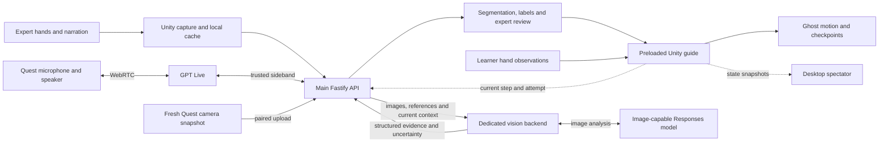

# Trail

**Record a physical task once. Follow the expert's movements in your own workspace, at your own pace.**

Trail is a mixed-reality physical-skill tutor being built for **Meta Quest 3S**
using **Unity + Meta XR**. An expert demonstrates and narrates a short task; a
learner follows translucent ghost-hand guidance and talks to a GPT Live coach
that receives visual evidence from a dedicated interpretation backend.

The first complete version must transfer a demonstration to a **different room
and table, using the same objects and starting layout**. Simple bottle and large
LEGO-style assemblies exercise the same engine with fresh recordings, rather
than task-specific code or cached answers.

[Implementation plan](docs/plan.md) · [Four-person task split](docs/team-plan.md) ·
[Scaffold status](docs/scaffold.md) · [Pending device checks](docs/device-check.md)

**New machine:** [Install dependencies](#install-dependencies-on-a-new-machine) →
[Run the desktop](#run-the-desktop-and-backend-scaffold) →
[Install Unity and build Android](#prepare-the-quest-app).

## Current status

This repository is a working desktop/backend scaffold with prepared Unity source
files. The native platform and browser voice diagnostics are implemented; the complete
headset experience described below is still being integrated and validated.

| Component | Available now | Still required |
| --- | --- | --- |
| Quest app | Resolved package lock, Android/OpenXR/URP setup, single-rig passthrough bootstrap, pairing client and native tests | Device validation, hand capture, calibration, ghost guidance, camera and voice adapters |
| Desktop | Synthetic Three.js replay, tracking-gap diagnostics, backend status and Voice Lab | Expert review, tutorial authoring and live spectator tools |
| Main API | Fastify health/static serving, scoped pairing primitives, authenticated vision health client and mock/OpenAI voice routes | Paired application composition, recording storage/uploads, inspection coordination and live-provider acceptance |
| Vision backend | Separate authenticated Fastify process with health and explicit non-readiness | Image decoding, visual model calls, structured assessments, cancellation and result delivery |
| Shared packages | Versioned recording/tutorial/inspection schemas, strict native parsing, parity fixtures and rigid transforms | Feature integration and physical calibration/transfer acceptance |

The vision service returns **503 for readiness** and **501 for inspections**;
a successful health check means only that the process is reachable. No live AI
or headset capability is implied. See [scaffold evidence](docs/scaffold.md).

## Intended experience

1. **Record:** the expert calibrates a marked mat, performs the task and narrates.
   Trail records hand motion, audio and reference images on coordinated timelines.
2. **Review:** Trail proposes movement boundaries and labels. The expert reviews
   the steps, motion gates, starting layout and visible outcomes before saving.
3. **Transfer:** the learner places the same mat and parts in their own room,
   restores the starting layout and independently calibrates. Three marks define
   the workspace; a fourth checks alignment. The tutorial is preloaded locally.
4. **Follow:** an articulated translucent ghost demonstrates the movement.
   Guidance follows the learner's pace; ordered motion gates and a valid hold
   determine when a movement checkpoint is reached.
5. **Ask:** after starting conversation, the learner can ask hands-free,
   “Am I doing this right?” A fresh headset image is assessed against the reviewed
   step, and GPT Live speaks the findings or asks for a clearer view.

The [assembly storyboard](docs/mockups/translucent-assembly-2026-09-19/guidance-sequence.png)
shows the intended visual direction. It is illustrative, not a headset screenshot
or proof of tracking accuracy.

### Transfer, scene understanding and object tracking

Hand motion is stored relative to the mat, so the learner's independently measured
mat pose places the recording on their table. Preserve physical scale, part sizes,
starting positions/orientations and dominant hand within a tutorial. Different
rooms, table heights, mat orientations, backgrounds and lighting are acceptance
conditions to test; the recording is never scaled to hide alignment error.

**TRAIL-19** adds a bounded MRUK scene-understanding milestone: evaluate the
learner's current room/surfaces for workspace setup, handle missing or stale scene
data and record whether scene assistance is usable. It supplements mat calibration.
Cross-room transfer remains required even if scene assistance is unavailable.

Object tracking is valuable for detecting moved parts and eventually adapting
motion to rearranged layouts. That requires object identity, pose, uncertainty
and source/destination relationships. Automatic retargeting of independently
rearranged parts, universal markerless tracking and detailed object reconstruction
are future work. A room mesh does not establish those capabilities. See
[scene and object feasibility](docs/plan.md#scene-understanding-and-object-tracking-feasibility).

## Target architecture



This diagram describes the target pipeline; current implementations are listed
in the status table above.

| Layer | Selected stack and responsibility |
| --- | --- |
| Headset | Unity/C#, Unity OpenXR, Meta Core/Interaction and MRUK; tracking, passthrough, camera, spatial UI and a separate recorded ghost |
| Motion runtime | Pure C# contracts/motion assemblies; deterministic local progression with runtime adapters handling I/O |
| Desktop | TypeScript, Vite, plain HTML/CSS and Three.js; review, diagnostics and spectator presentation |
| Main backend | `apps/server`: TypeScript/Fastify; storage, pairing, tutorial processing, GPT Live sideband and inspection coordination |
| Visual backend | `apps/vision`: separate TypeScript/Fastify process; image interpretation through an image-capable Responses model |
| Contracts | Zod and versioned JSON fixtures; strict native DTO parsing and validation |
| Persistence | Planned laptop files and Unity application-private cache; no cloud database required |

The two backend processes initially run on the demo laptop. Provider credentials
stay in the backends; the headset connects to the main API and never receives
provider keys or the internal vision-service token.

### Visual coaching is required

The planned flow is **Quest camera → main API → vision backend → validated
findings → GPT Live → spoken headset feedback**. GPT Live supplies conversation;
the vision backend supplies image interpretation. Audio/text-only conversation
cannot satisfy the visual-coaching acceptance gate.

Inspect correct-looking, visibly wrong, obscured and subsequently adjusted scenes.
Fresh evidence must change the answer actually heard in the headset. Reject stale
images and results from old questions, steps or attempts. A webcam is a disclosed
development/reduced-demo source, not headset-camera acceptance.

An admitted inspection locally pauses guidance and clears partial dwell; the
learner explicitly chooses Resume or Repeat afterward. A favorable assessment
never advances the guide. If vision is unavailable, the coach must disclose that
it cannot inspect the scene. See the [visual backend design](docs/plan.md#gpt-live-conversation-and-fresh-visual-coaching).

## Install dependencies on a new machine

The repository uses two package systems: **pnpm** installs the TypeScript
workspace, and **Unity Package Manager (UPM)** installs the native SDKs. You need
both for full development. Desktop/backend work only needs the first one.

| Install | Version / source | Needed for |
| --- | --- | --- |
| Git | Your OS package manager or [Git downloads](https://git-scm.com/downloads) | Cloning the repository |
| Node.js | [22.23.1 download](https://nodejs.org/en/download/archive/v22.23.1), matching [.node-version](.node-version); includes npm 10.9.8 | All pnpm commands |
| pnpm | **11.3.0**, matching `packageManager` in [package.json](package.json) | Web, server, vision and shared packages |
| Chromium | Downloaded by the repository's Playwright version | Browser tests only |
| Unity Hub + editor | Hub from [Unity](https://unity.com/download); editor **6000.3.24f1**, revision **4e7b9b5b6244** | Quest project only |
| Android toolchain | Android Build Support **with SDK & NDK Tools and OpenJDK** through that editor's Hub modules | APK compilation only |

The native installation/build was verified on Apple Silicon macOS with Hub
3.21.3. Other host platforms have not been validated for this project; choose
the editor for your host and configure `UNITY_EDITOR` as described below. A
Quest headset is needed for device testing, not for compilation or EditMode tests.

### Clone and install the workspace

Install the pinned Node.js version for your OS/CPU from the link above. If you
already use a Node version manager, select `22.23.1` with it instead. Then run:

```sh
git clone https://github.com/aidanjnn/trail.git
cd trail
node --version                      # expected: v22.23.1
npm install --global pnpm@11.3.0     # bootstrap the pinned package manager once
pnpm --version                      # expected: 11.3.0
pnpm install --frozen-lockfile
```

If you already have pnpm 11.3.0, skip its global installation. npm is only used
here to bootstrap pnpm; use pnpm at the repository root for project dependencies.
The root install links all workspace packages, including `apps/server`,
`apps/vision`, `apps/web`, contracts and motion. Do not separately run `npm install`
inside each app or generate a `package-lock.json`. Keep [pnpm-lock.yaml](pnpm-lock.yaml)
and the lifecycle-script policy in [pnpm-workspace.yaml](pnpm-workspace.yaml).

Install the browser test binary and verify the workspace:

```sh
pnpm exec playwright install chromium
pnpm check
pnpm validate:fixtures
pnpm test:e2e
```

On Linux, use `pnpm exec playwright install --with-deps chromium` if system
browser libraries are missing; this is the command used in CI. The checks above
do not install or compile Unity. The default scaffold needs no API keys, database,
Docker, Android Studio or globally installed TypeScript/Vite/Fastify packages.
Unity's separate downloads are covered below.

## Run the desktop and backend scaffold

After installing the workspace, run from the repository root:

```sh
pnpm dev
```

Open `http://127.0.0.1:5173`. The page shows a synthetic two-second hand recording
with Play/Pause, Reset, scrubbing and a deliberate tracking gap.

The launcher starts shared-package watchers and these services:

| Process | Default address | Current role |
| --- | --- | --- |
| Desktop/Vite | `127.0.0.1:5173` | Fixture UI; proxies `/api` and the reserved `/ws` path to the main API |
| Main API | `127.0.0.1:3001` | `/api/health`, `/api/dependencies/vision` and built static assets when using `pnpm start` |
| Vision | `127.0.0.1:3002` | Authenticated `/internal/v1/health`, `/internal/v1/ready` and unimplemented inspection route |

Defaults require no provider credentials. The launcher generates an ephemeral
internal service token if none is configured. Optional settings are documented
in [.env.example](.env.example); copy it to an ignored `.env` only if needed,
preserving any existing file. Backend startup loads the root `.env`; existing
process environment variables take precedence.

Occupied ports cause a clear failure before services start. Existing processes
are left untouched. To run an isolated stack:

```sh
PORT=3201 DEV_WEB_PORT=5273 VISION_PORT=3202 pnpm dev
```

If `.env` explicitly sets `VISION_SERVICE_URL`, update that override to match the
chosen vision port. Use `pnpm dev:web` for desktop/main-API development without
starting vision. For independent backend terminals and matching service tokens,
follow the [vision service setup](apps/vision/README.md).

| Command | What it runs |
| --- | --- |
| `pnpm dev` | Desktop, main API, vision skeleton and shared watchers |
| `pnpm dev:web` | Desktop, main API and shared watchers |
| `pnpm build` | Shared packages, desktop and both backend builds |
| `pnpm check` | Strict TypeScript, unit/API tests, builds and static Unity-file checks |
| `pnpm validate:fixtures` | Shared build and recording-fixture validation |
| `pnpm test:e2e` | Chromium tests against the built desktop/main API on port 3101; build first |
| `pnpm start` | Built main API and desktop assets; does not start vision |
| `pnpm start:vision` | Built vision service; requires an internal service token |
| `pnpm check:quest-scaffold` | Native file/GUID/assembly checks without Unity compilation |
| `pnpm quest:setup` | Apply Android scaffold settings with an installed Unity editor |
| `pnpm quest:test` | Run actual EditMode tests with an installed Unity editor |
| `pnpm quest:test:play` | Run native PlayMode lifecycle/pairing tests in the editor |
| `pnpm quest:build` | Build a release ARM64/IL2CPP platform APK |
| `pnpm test:native-network` | Run the pure C# network-policy harness; requires .NET 8 SDK |

For browser tests, install Chromium once with `pnpm exec playwright install chromium`,
then run `pnpm check` and `pnpm test:e2e`. CI runs the automated gates; these do
not establish native or physical readiness.

### Voice and AI diagnostics

The browser Voice Lab at `http://127.0.0.1:5173/voice-lab.html` provides recorder,
transcription, label and coach diagnostics.

Mock mode works with no credentials: transcription returns the synthetic fixture,
labels use the deterministic fallback, and the coach answers with the stored step
text. To use OpenAI, set `AI_PROVIDER=openai` and `OPENAI_API_KEY=sk-...` in the
root `.env`, restart `pnpm dev`, and open the Voice Lab. Keys never leave the
server: the browser exchanges an SDP offer through `POST /api/live/sessions`, and the
server creates the GPT-Live session. Live mode is verified manually; CI covers mock
and text paths. Answers are grounded in the tutorial text and cannot advance a step.
When pairing is configured (`PAIRING_ORIGINS` or `ALLOW_USB_LOOPBACK`), narration
and label routes require an author token, the coach routes require a learner or
author token on the current session, and the coach speaks only from the stored
tutorial, rejecting unknown, stale, or draft tutorials for learners. Step changes
reach the live model through the server's own channel: the client posts a step ID
to `POST /api/live/sessions/:id/step` and the browser data channel can no longer
append text. The Voice Lab then shows a pairing form: paste the author code from
`data/<dir>/pairing.json` (or one minted in the authoring workbench) to record and
label; its coach falls back to local text because the lab's steps are not a saved
guide. Plain `pnpm dev` configures no pairing, stays open, trusts the client
context, and must stay on loopback.
There is no per-session cap yet, and each live session bills at least 15 seconds. The browser coach,
recorder and Voice Lab are desktop diagnostics that validate the server protocol;
the planned Unity client (TRAIL-16) reuses the same routes through a native WebRTC
adapter, and native audio is verified only on the APK.

See the [provider implementation notes](apps/server/src/ai/README.md).

## Prepare the Quest app

The [Unity source project](apps/quest/README.md) is in `apps/quest`. The local
**Unity 6000.3.24f1**, **Meta XR 205.0.0**, **OpenXR 1.18.0** and **WebRTC 3.0.0**
package set has resolved and compiled, with a generated UPM lockfile and
passing native tests. See [native setup evidence](docs/native-setup.md) for the
Android build result and exact installed toolchain.

### Install the editor and Android modules

1. Install [Unity Hub](https://unity.com/download), sign in with **your own Unity
   account**, review its terms and activate a license appropriate for your use.
   The recorded local setup used Unity Personal. License activation and account
   sign-in are per developer; they are not copied from this repository.
2. Open the [6000.3.24f1 release page](https://unity.com/releases/editor/whats-new/6000.3.24f1)
   and use its Hub installation link if that exact version is absent from Hub's
   normal list. Match [ProjectVersion.txt](apps/quest/ProjectSettings/ProjectVersion.txt).
   On Apple Silicon, select the ARM64 editor.
3. Select **Android Build Support**, including **Android SDK & NDK Tools** and
   **OpenJDK**. For an existing editor, use its **Add modules** action in Hub.
   Let all modules finish downloading before opening the project. Use the
   editor-bundled tools in Unity's External Tools preferences; a separate Java
   or Android Studio installation is unnecessary for this setup. See Unity's
   [Android environment setup](https://docs.unity3d.com/6000.3/Documentation/Manual/android-sdksetup.html).
4. In Hub, add the existing **`apps/quest` directory** from your clone, then open
   it with the pinned editor. Do not create a new template project. Allow the
   first package download, asset import and C# compilation to finish.
5. If prompted about input, use **Project Settings → Player → Other Settings →
   Active Input Handling → Input System Package (New)** and restart. Open
   `Assets/Trail/Scenes/Trail.unity`; a default Untitled scene is not Trail.

Unity reads [manifest.json](apps/quest/Packages/manifest.json) and
[packages-lock.json](apps/quest/Packages/packages-lock.json) to resolve the SDKs.
The Meta scoped registry is already configured; no manual `.unitypackage`
downloads or separate npm installs of Meta packages are needed.

| Unity package group | Resolved version |
| --- | --- |
| Meta XR Core, Interaction, OVR integration and MRUK | 205.0.0 |
| Unity OpenXR / XR Management / XR Hands | 1.18.0 / 4.5.4 / 1.7.2 |
| URP / uGUI / TextMeshPro | 17.3.0 / 2.0.0 / 5.0.0 |
| WebRTC / Test Framework | 3.0.0 / 1.6.0 |

The lockfile includes transitive/editor packages and required built-in modules.
Keep both Unity package files, `ProjectSettings` and asset `.meta` files in Git.
Keep generated `Library`, build artifacts, local licenses and debugger credentials
out of Git. Each machine downloads its own package cache. First installation
requires Internet access and space for the editor, Android modules, package
cache and IL2CPP build intermediates.

### Compile, test and build the APK

**Close this project's editor before running batch commands.** From the repository
root, after the pnpm installation above:

```sh
pnpm quest:setup
pnpm quest:test
pnpm quest:test:play
pnpm quest:build
```

The wrappers automatically find the default macOS Hub editor. For another
installation, set `UNITY_EDITOR` to the **executable**, not the project directory
or `.app` bundle, before running those commands. Examples:

```sh
# macOS bash/zsh; adjust if you installed elsewhere
export UNITY_EDITOR="/Applications/Unity/Hub/Editor/6000.3.24f1/Unity.app/Contents/MacOS/Unity"
```

```powershell
# Windows PowerShell; adjust to the actual Hub editor location
$env:UNITY_EDITOR = 'C:\Program Files\Unity\Hub\Editor\6000.3.24f1\Editor\Unity.exe'
```

On Linux, set the same environment variable to the installed editor's
`Editor/Unity` executable. These non-macOS paths are configuration examples,
not results of cross-platform native testing.

`quest:setup` imports/compiles the project and applies Android/OpenXR/URP
settings. Test commands require passing, nonempty EditMode/PlayMode reports.
`quest:build` builds a release **ARM64/IL2CPP platform APK**; the native connection
requires HTTPS. For explicitly scoped USB-loopback development instead:

```sh
# bash/zsh
TRAIL_DEVELOPMENT_BUILD=1 pnpm quest:build
```

In PowerShell, set `$env:TRAIL_DEVELOPMENT_BUILD = '1'` before the build and remove
it afterward with `Remove-Item Env:TRAIL_DEVELOPMENT_BUILD` when returning to release builds.
Each command prints its unique `artifacts/quest/<action>-<id>/` directory.
It contains `unity.log`, `results.xml` for tests, or `Trail.apk` and `build.json`
for builds. Build evidence must confirm the pinned editor, Android, ARM64 and
IL2CPP. pnpm itself does not install the editor or UPM SDKs.

There is no prebuilt APK committed to the repository. Building locally produces
your APK; cloning does not download another developer's local build or signing
credentials. A successful build verifies the toolchain, not a working headset demo.

Optional pure C# diagnostics use [.NET SDK 8.0.425](https://dotnet.microsoft.com/en-us/download/dotnet/8.0)
(the verified .NET 8 SDK version).
After installing it, run `pnpm test:native-network` and
`pnpm --filter @trail/contracts test:native`. Unity itself supplies the compiler
for its own editor tests and APK; the .NET SDK is only for these separate harnesses.

### Setup troubleshooting

| Symptom | Check |
| --- | --- |
| Wrong Node/pnpm version or engine error | Select `.node-version` and `package.json`'s `packageManager`; reopen the terminal after installation. |
| Frozen pnpm install fails | Check out matching manifests and `pnpm-lock.yaml`; preserve the lock and inspect the error instead of regenerating it as a first step. |
| Unity executable missing | Install the exact editor or set `UNITY_EDITOR` to its executable. |
| License/terms prompt | Complete your own Hub/editor sign-in, terms review and license activation before batch checks. |
| Project already open | Close its Unity editor before running `quest:*`; unrelated projects can stay open. |
| Android SDK/NDK/JDK missing | Add all Android child modules in Hub and select the bundled tools in Unity External Tools. |
| Package download/import error | Check Internet access to Unity and `https://npm.developer.oculus.com`, then inspect Unity Package Manager and the batch log. Retain the pinned manifest/lock. |
| Browser tests cannot find Chromium | Run `pnpm exec playwright install chromium` (Linux may need `--with-deps`). |
| Meta setup warnings or no headset content | The platform bootstrap requires device testing; SDK resolution/build success does not complete the remaining XR work below. |

The scene runs `NativeBootstrap`, which creates one OpenXR/Meta rig and
passthrough underlay after XR initialization. URP, Vulkan, the concrete XR Hands
subsystem and required Meta features are configured by setup. Feature installers
supply capture, guidance, scene and storage behavior; the platform alone does not
prove those capabilities. See the [native project guide](apps/quest/README.md)
and [device checklist](docs/device-check.md).

The native API client and scoped pairing primitives are implemented; application
route composition is delivered by the authoring/storage workstream. Follow
[pairing setup](docs/pairing.md) before expecting a connected headset session.
For an explicitly enabled loopback server and development APK, use
`adb reverse tcp:3001 tcp:3001`; release builds and untethered use require HTTPS.
Controllers support UI/recovery, but cannot substitute for bare-hand capture.
The browser fixture does not launch or validate the Unity app.

## Repository and implementation order

| Location | Role |
| --- | --- |
| `apps/quest/` | Native project, pure C# domain, feature-owned runtime modules and editor/test entry points |
| `apps/web/` | Synthetic replay and planned review/spectator tools |
| `apps/server/` | Main API and trusted coordination |
| `apps/vision/` | Separate visual interpretation service |
| `packages/contracts/` | Strict TypeScript wire schemas; recording v1 remains unchanged |
| `packages/motion/` | Pure math and planned offline authoring/reference logic |
| `fixtures/`, `tests/e2e/` | Synthetic contract/recording fixtures and desktop acceptance tests |
| `docs/` | Plan, ownership, setup evidence and Codex activity log |

Continue from the [dependency-ordered tickets](docs/plan.md#17-immediate-tickets-to-create).
The scaffold is only part of TRAIL-18/20, not completion of those tickets.

1. Resolve/build the native project and freeze shared contracts and coordinate mapping.
2. Prove real hand capture, independent calibration and recorded ghost replay.
   In parallel, implement native GPT Live transport and the visual backend.
3. Complete one local interactive step, then a fresh multi-step tutorial with
   reviewed references and camera-grounded spoken feedback.
4. Prove transfer to another room/table and evaluate bounded MRUK setup assistance.
5. Repeat with the second task family, then run recovery, clarity and novice trials.

The [four-person plan](docs/team-plan.md) assigns headset/spatial work to Person 1,
motion/contracts to Person 2, voice/vision to Person 3, and platform/integration
to Person 4. Integration owns shared manifests/locks and the main Unity scene;
feature owners supply their own prefabs and tests.

## Validation and boundaries

Historical scaffold checks included **39 unit/API tests**, **3 Chromium tests**,
builds, fixture validation and static Unity-file checks. The merged platform,
contracts and voice workstreams add coverage; current integration results are
recorded in [native setup evidence](docs/native-setup.md). Development smoke tests
verified authenticated service communication and that stopping vision leaves
the main API/desktop usable. These are recorded results, not a claim about every
future revision; see [validation evidence](docs/scaffold.md#rescaffold-verification).

Local Unity package resolution, C# compilation and the existing EditMode tests
have passed; see [native setup evidence](docs/native-setup.md) for the APK result.
Live providers and headset trials remain unverified. Record actual headset results in `docs/validation.md`
when they exist, including revision, device/software, scenario and measurements.

- **Unity alone owns progression.** AI can explain and assess visible evidence;
  it cannot invent spatial coordinates or complete a movement step.
- **Movement is not assembly verification.** “Movement checkpoint reached” does
  not prove grasp, thread engagement, tightness, attachment or a watertight seal.
- **Freshness matters.** Tracking loss, reference changes and stale observations
  must clear partial progress and invalidate affected guidance or inspection.
- **Offline behavior needs evidence.** Continuing an already preloaded guide
  without the backend is required; cold offline startup is a separate test.
- **Generality needs fresh tasks.** Two task families exercise reuse, not support
  for every physical object. Dangerous tasks and precision-tool use are excluded.
- Keep keys, camera frames, raw narration and personal recordings out of Git and
  logs. Real fixtures require explicit consent and review.

Read [AGENTS.md](AGENTS.md) before contributing. Use focused `codex/` branches,
coordinate shared-schema changes and keep [the Codex log](docs/codex-log.md)
current. Validation selection is documented in
[the repository's validation guide](.agents/references/validation.md).
