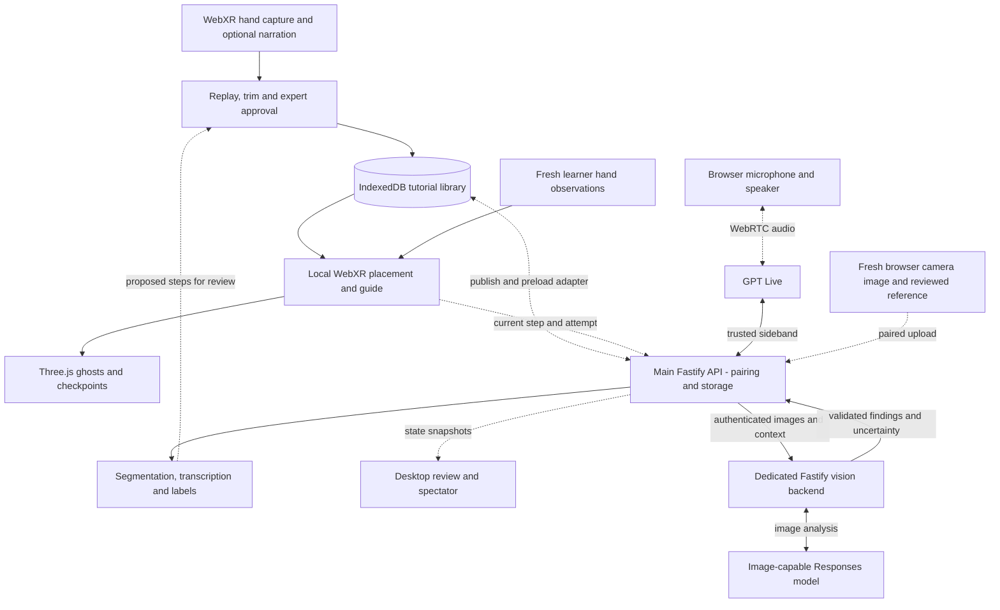

# TeachAR

**Record a physical task once. Follow the expert's movements in your own workspace, at your own pace.**

TeachAR is a mixed-reality physical-skill tutor being built for **Meta Quest 3S**
using **Quest Browser, WebXR and Three.js**. An expert demonstrates a short task;
a learner follows translucent ghost hands and movement checkpoints in their own
workspace. Spoken guidance and camera-grounded coaching extend that local loop.

**WebXR is the product foundation**, carrying forward the stack from
[PR #17](https://github.com/aidanjnn/trail/pull/17),
[PR #23](https://github.com/aidanjnn/trail/pull/23) and
[PR #24](https://github.com/aidanjnn/trail/pull/24). The Unity project, C# code and
editor/APK tooling are retired; their history remains in Git and the
[activity log](docs/codex-log.md). The main API, dedicated vision backend and
deterministic guidance principles carry forward.

The first complete version must transfer a demonstration to a **different room
and table, using the same objects and starting layout**. Simple bottle and large
LEGO-style assemblies exercise the same engine with fresh recordings, rather
than task-specific code or cached answers.

[Web delivery plan][web-delivery] · [Implementation plan](docs/plan.md) ·
[Four-person task split](docs/team-plan.md) · [Scaffold history](docs/scaffold.md) ·
[Sentry integration and sponsor evidence](docs/sentry.md)

**OpenAI track:** [Judge brief and demo plan](docs/openai-track.md) ·
[Concrete Codex improvements](docs/codex-impact.md) · [Development log](docs/codex-log.md).

**New machine:** [Install dependencies](#install-dependencies-on-a-new-machine) →
[Run the Quest Browser tutor](#prepare-the-quest-browser-tutor) →
[Run the desktop and backend](#run-the-desktop-and-backend-scaffold).

## Current status

The functional browser tutor is packaged in `apps/webxr`.
Start with [the Quest Browser instructions][browser-guide]; the product entry is
`/tutorial` or `/` on port 4321. `pnpm dev` starts this tutor;
`pnpm dev:desktop` starts the separate desktop/backend app.
No Unity install or API key is needed for hand recording and ghost guidance.
Private recordings and keys, including local files left in the retired source
directories after upgrading, remain excluded from Git.

For paired voice and narration drafting, run `pnpm build` then `pnpm dev:desktop`, reverse port 3001
with `adb reverse tcp:3001 tcp:3001`, and open `http://localhost:3001/tutorial`.
The main API serves the same tutor source so pairing and coach calls share its origin.
Live voice uses server-side `AI_PROVIDER=openai` and credentials.


| Component | Available in source | Still required |
| --- | --- | --- |
| Quest Browser tutor (PR #17/#23/#24) | Connected Create/Follow UI, tracked-hand capture, review/trim and required-hand selection, durable local saves, rigid placement, ghosts, preview-first practice and automatic movement-only transitions | Headset recovery, tuning and independent transfer acceptance |
| Local media and assistance (PR #17) | Optional narration/reference photos, palm zones and a separate bounded camera-checking experiment | Concurrent mic/camera/immersive hands validation; general tutorial coaching integration |
| Desktop | Replay diagnostics, authoring/review, storage/spectator tools and Voice Lab | Verify concurrent headset voice and finish the presentation |
| Main API | Scoped pairing, durable recording/tutorial publication, inspection coordination and voice routes | Fresh visual coaching and live headset acceptance |
| Vision backend | Authenticated inspection jobs, image validation, bounded provider adapter and cancellation | Fresh-headset/live-model acceptance and measured reliability |
| Shared packages | Strict recording/tutorial/inspection schemas, shared fixtures, rigid transforms and authoring logic | Explicit browser-format conversion and physical transfer acceptance |

No API key is needed for hand recording or ghost guidance. The paired API connects
the tutor to voice coaching and narration drafts; fresh visual coaching and concurrent
headset acceptance remain pending. The [standalone UI reference][ui-reference] remains
simulated; its connected DOM/XR implementation is described in [the UI base](docs/web-ui-base.md).
See [web delivery status][web-delivery] for the feature inventory and remaining work.

Health means reachability, not provider or headset readiness. The vision service
defaults to an unavailable mock provider; its implemented inspection route does
not establish live image interpretation. Historical Unity setup and validation
remain in Git and the [activity log](docs/codex-log.md).

## Intended experience

1. **Record:** the expert enters AR in Quest Browser, places the workspace and
   sets one save position for the tutorial. Record tracked hands, pause/resume
   between actions, and optionally attach narration and reference photos.
2. **Review:** replay the captured movements, inspect trimmed ends, edit
   instructions, explicitly choose the required hands and approve each step. Await
   the durable save to the browser's local
   library; export/import supports deliberate backup and transfer.
3. **Transfer:** the learner restores the same objects and starting layout,
   places the tutorial using an origin and heading, and previews alignment at
   its original scale. Load the reviewed tutorial before following it.
4. **Follow:** articulated translucent ghosts demonstrate the movement. A start
   gate, ordered movement targets and a valid checkpoint hold respond to the
   learner's pace. Each step previews first; movement completion starts the next
   preview and leaves physical results unverified. Pause and Repeat stay local.
5. **Ask:** the target coach lets the learner ask, “Am I doing this right?” A
   fresh headset image is assessed against the reviewed step, then GPT Live
   speaks the findings or asks for a clearer view. This backend-to-tutor flow
   still needs integration and live headset validation.

The [assembly storyboard](docs/mockups/translucent-assembly-2026-09-19/guidance-sequence.png)
and [browser UI reference][ui-reference] show the visual direction. They are
illustrations, not evidence of tracking accuracy or headset acceptance.

### Transfer, scene understanding and object tracking

The browser prototype places recorded motion with a rigid origin/heading
transform: translate and rotate, without stretching. Preserve physical scale,
part sizes, starting positions/orientations and dominant hand within a tutorial.
Different rooms, table heights, workspace orientations, backgrounds and lighting
remain acceptance conditions to test.

The earlier native three-mark fit and held-out fourth-mark check are reference
work, not the browser's current placement workflow. Browser placement needs its
own measured alignment evidence, and a reference-space reset or new XR session
requires registration again.

WebXR passthrough display does not itself provide camera pixels, room meshes or
object poses. Feature-detect the installed browser's capabilities and validate
fresh camera access separately. Unity MRUK components cannot run in the browser;
the WebXR tutor does not depend on porting them to begin local guidance.

Object tracking may later help detect moved parts and adapt motion to rearranged
layouts. Automatic retargeting, detailed reconstruction and reliable hidden-hand
or object-contact assessment remain future work. See the
[browser capability and transfer boundaries][web-delivery].

## Target architecture



The local browser loop is implemented in the PR #17/#23/#24 stack. Dotted connections show the
remaining browser/backend, spectator and coaching integration. Backend/provider
paths retain the existing service architecture; their presence in source does
not establish live-provider acceptance. The prototype's Python development
server serves the tutor and separate camera experiments; it is distinct from
the two Fastify services.

| Layer | Selected stack and responsibility |
| --- | --- |
| Headset | Quest Browser, WebXR and Three.js; hand input, passthrough session, spatial controls and recorded ghosts |
| Motion runtime | Browser JavaScript modules; deterministic local progression, with XR/rendering/storage effects in adapters |
| Desktop | TypeScript, Vite, HTML/CSS and Three.js; review, diagnostics, Voice Lab and spectator presentation |
| Main backend | `apps/server`: TypeScript/Fastify; storage, pairing, tutorial processing, GPT Live sideband and inspection coordination |
| Visual backend | `apps/vision`: separate TypeScript/Fastify process; bounded image interpretation through an image-capable Responses model |
| Contracts | Validated browser prototype format plus existing Zod/versioned JSON contracts; an explicit adapter is required between them |
| Persistence | Browser-origin IndexedDB and explicit export/import today; Fastify file storage retained for service integration; no cloud database required |

**The headset browser owns progression.** AI supplies instructions and advisory
findings; it cannot invent coordinates, change tolerances or advance a step.
Rendering, audio, storage and network effects stay outside the pure motion logic.
`trail.tutorial.prototype.v3` differs from the shared API recording/tutorial v1
wire format; do not silently pass browser JSON to existing backend routes.

The two backend processes run on the demo laptop. Provider credentials stay in
the backends; clients never receive provider keys or the internal vision token.
Local hand guidance runs without either AI provider. The browser library is
specific to its device and origin and is not automatically synchronized.

### Visual coaching is required

The target flow remains **fresh headset camera image → main API → vision backend
→ validated findings → GPT Live → spoken headset feedback**. Browser capture
and approved tutorial context must be explicitly connected to those services.
The earlier plushie image checker is a separate experiment, not generalized
tutorial verification.

Inspect correct-looking, visibly wrong, obscured and subsequently adjusted scenes.
Fresh evidence must change the answer actually heard in the headset. Reject stale
images and results from old questions, steps or attempts. A webcam is a disclosed
development/reduced-demo source, not headset-camera acceptance.

The integration must pause guidance and clear partial dwell for an admitted
inspection; the learner chooses Resume or Repeat afterward. A favorable
assessment never advances the guide. If vision is unavailable, the coach must
disclose that it cannot inspect the scene. See the
[vision service](apps/vision/README.md) and [browser integration plan][web-delivery].

## Install dependencies on a new machine

The browser path uses **pnpm** for the existing JavaScript/TypeScript workspace
and **Python** for the prototype's local server. Unity, UPM and an APK build are
not required to run the tutor. Launchers support **macOS and Linux**, require a
POSIX shell (`sh`) and use `.venv/bin/python`. Native Windows startup is not supported.

| Install | Version / source | Needed for |
| --- | --- | --- |
| Git | Your OS package manager or [Git downloads](https://git-scm.com/downloads) | Cloning the repository |
| Node.js | [22.23.1 download](https://nodejs.org/en/download/archive/v22.23.1), matching [.node-version](.node-version) | All pnpm commands and prototype asset preparation |
| pnpm | **11.3.0**, matching `packageManager` in [package.json](package.json) | Web, server, vision and shared packages |
| Python | **3.12+**, with `venv` and pip | Browser prototype server and Python checks |
| Chromium | Downloaded by the repository's Playwright version | Synthetic browser tests |
| Android SDK platform-tools | `adb` on PATH | USB connection to Quest Browser |
| Quest Browser | Installed on the Quest 3S; record its actual version when testing | Real WebXR hand input and immersive sessions |

### Clone and install the workspace

Install the pinned Node.js version for your OS/CPU from the link above. If you
already use a Node version manager, select `22.23.1` with it instead. Then run:

```sh
git clone https://github.com/aidanjnn/trail.git
cd trail
node --version                      # expected: v22.23.1
npm install --global pnpm@11.3.0     # bootstrap the pinned package manager once
pnpm --version                      # expected: 11.3.0
pnpm install --frozen-lockfile
```

If you already have pnpm 11.3.0, skip its global installation. Use pnpm at the
repository root for project dependencies; do not generate per-app npm lockfiles.
Keep [pnpm-lock.yaml](pnpm-lock.yaml) and the lifecycle-script policy in
[pnpm-workspace.yaml](pnpm-workspace.yaml).

Install the browser test binary and verify the existing workspace:

```sh
pnpm exec playwright install chromium
pnpm check
pnpm validate:fixtures
pnpm test:e2e
```

On Linux, use `pnpm exec playwright install --with-deps chromium` if system
browser libraries are missing. These checks need no paid provider credentials
or Unity installation. The prototype's additional checks are described below.

## Run the desktop and backend scaffold

After installing the workspace, run from the repository root:

```sh
pnpm dev:desktop
```

Open `http://127.0.0.1:5173` for desktop replay/authoring diagnostics. **This does
not start the headset tutor**, which runs separately at `/tutorial` on port 4321.

| Process | Default address | Current role |
| --- | --- | --- |
| Desktop/Vite | `127.0.0.1:5173` | Replay, authoring and Voice Lab; proxies `/api` and `/ws` to the main API |
| Main API | `127.0.0.1:3001` | Pairing, tutorial/recording storage, voice, inspection coordination and relay |
| Vision | `127.0.0.1:3002` | Authenticated health/readiness, bounded inspections and cancellation |

Defaults require no provider credentials. The launcher generates an ephemeral
internal service token if none is configured. Optional settings are documented
in [.env.example](.env.example); copy it to an ignored `.env` only if needed,
preserving any existing file. Backend startup loads the root `.env`; existing
process environment variables take precedence.

Occupied ports cause a clear failure before services start. To run an isolated
stack, use `PORT=3201 DEV_WEB_PORT=5273 VISION_PORT=3202 pnpm dev:desktop`. If `.env`
explicitly sets `VISION_SERVICE_URL`, match it to the chosen vision port. For
independent terminals and matching tokens, follow the
[vision service setup](apps/vision/README.md).

| Command | What it runs |
| --- | --- |
| `pnpm dev` / `pnpm dev:xr` / `pnpm start` | WebXR tutor on port 4321 |
| `pnpm setup:webxr` | Prepare Python dependencies and verified Three.js assets |
| `pnpm quest:open` | Start/reuse this checkout's tutor and open it on a USB-connected Quest |
| `pnpm dev:desktop` | Desktop, main API, vision service and shared watchers |
| `pnpm dev:web` | Desktop, main API and shared watchers |
| `pnpm build` | Shared packages, desktop, both backends and verified WebXR assets |
| `pnpm check` | Strict TypeScript, unit/API tests and builds |
| `pnpm validate:fixtures` | Shared build and recording-fixture validation |
| `pnpm test:e2e` | Chromium tests against the built desktop/main API on port 3101; build first |
| `pnpm test:webxr` | Node, Python and isolated synthetic WebXR browser tests |
| `pnpm start:server` | Built main API and desktop assets; does not start vision |
| `pnpm start:vision` | Built vision service; requires an internal service token |

`pnpm build` prepares static assets; it does not start or publish the WebXR server.
Hosted software checks do not establish physical transfer or live-provider readiness.

### Voice and AI diagnostics

The browser tutor carries the same coach. Its Voice coach card pairs the browser, publishes
the current tutorial's reviewed step titles and instructions as a **coach guide**
(`POST /api/coach-guides`, author only), and starts the coach before AR so the XR entry click
stays synchronous. Step changes and restarts reach the model through the server's own channel;
an Ask coach button on the headset panel opens the microphone. The review screen's
"Draft titles from narration" sends each step's WAV through `whisper-1` and the label route and
shows the drafts for the expert to apply. With the mock provider the coach answers in text; with
a real key it goes live and says one short greeting so the presenter hears the audio path before
entering AR (`OPENAI_LIVE_GREETING=off` silences it). Microphone, WebRTC and an immersive session
together on the Quest are not yet verified; [docs/voice-demo-checklist.md](docs/voice-demo-checklist.md)
is the headset rehearsal list.


Mock mode needs no credentials. OpenAI mode uses `AI_PROVIDER=openai` and a server-side
`OPENAI_API_KEY` in the root `.env`; keys never belong in browser assets or tutorial exports.

The browser Voice Lab at `http://127.0.0.1:5173/voice-lab.html` provides recorder,
transcription, label and coach diagnostics.

The existing server creates live sessions through `POST /api/live/sessions` and
owns the model's step context. In paired mode, it validates roles and stored
tutorials; updates carry step/generation identity and reject stale context.
The Voice Lab's unsaved steps fall back to local text on a paired server.
Plain `pnpm dev:desktop` without pairing configuration must remain on loopback.

The tutor now publishes reviewed step text through a validated coach-guide adapter
and follows the current step through its local coach hook. Fresh reference-image
and visual-coaching integration remain pending. Simultaneous headset audio, camera
and hand tracking still require device acceptance. See the
[provider notes](apps/server/src/ai/README.md) and [web delivery plan][web-delivery].

## Prepare the Quest Browser tutor

For paired voice coaching use the main API at `http://localhost:3001/tutorial`
with `pnpm dev:desktop`. The Python launcher below serves local guidance and the
separate camera lab.

Start with the [runnable tutor guide][browser-guide]. The source is included
in this checkout under `apps/webxr`. No separate JavaScript installation is needed.

### Start the local tutor

From the repository root after installing dependencies:

```sh
pnpm dev
```

The first start creates a Python virtual environment, installs `requirements.txt`
and prepares the exact locked Three.js assets with hash/license checks. Open
`http://127.0.0.1:4321/tutorial` to inspect the library and review UI on desktop.
The root `/` opens the same tutor; the earlier camera checker is at `/lab`.
Keep the server running; actual hand tracking and AR require the headset.
`pnpm start` uses the same launcher. Stop the foreground server with Ctrl-C.

### Connect Quest Browser over USB

Enable Quest developer mode, connect USB, accept debugging on the headset and
confirm that `adb devices -l` shows an authorized device. In another terminal,
from the repository root:

```sh
pnpm quest:open
```

The script configures `adb reverse tcp:4321 tcp:4321` and opens
`http://localhost:4321/tutorial` in Quest Browser. Keep USB connected and the
laptop awake. Choose **Create tutorial** or **Follow tutorial**, then use the
page's AR entry control. Hand guidance requires neither a camera nor an API key.
Close other camera-sender tabs before testing optional camera capture.
Use `PORT=4331 pnpm dev` and `PORT=4331 pnpm quest:open` for another local port;
a running server from another checkout is not silently reused.

The prototype is a loopback, single-user development server. Ordinary remote
hosting requires HTTPS and a deliberate authenticated deployment path. Browser
storage is origin-specific: changing device, host name or port does not carry
the library with it. Use explicit export/import for backup or transfer.

### Run the browser regression suite

After setup, from the repository root:

```sh
pnpm exec playwright install chromium
pnpm setup:webxr
pnpm test:webxr
```

This runs Node/Python checks and eleven synthetic browser workflows on an isolated
server with temporary data and disabled provider credentials. It does not reuse
the live port 4321 server. Hosted CI runs this suite alongside the
workspace checks. See [the prototype guide][browser-guide] for runtime overrides.

### Setup troubleshooting

| Symptom | Check |
| --- | --- |
| Wrong Node/pnpm version or frozen install fails | Match `.node-version`, `package.json` and the committed lockfile; inspect the error before regenerating dependencies. |
| Python environment fails to initialize | Use Python 3.12+ with `venv` and pip available, then rerun `pnpm setup:webxr`. Set `TRAIL_PYTHON` to select an interpreter. |
| Quest is absent or unauthorized in ADB | Enable developer mode, accept USB debugging and check the data cable. |
| Tutor does not load in Quest Browser | Keep the laptop server running and USB connected; check port 4321 forwarding and the `/tutorial` URL. |
| Desktop page has no live hands | Enter AR on the headset; desktop review and synthetic tests do not supply real tracking. |
| Tutorials appear missing | Return to the original browser origin or import an explicit export; storage is not automatically synchronized. |
| Browser tests cannot find Chromium | Run `pnpm exec playwright install chromium` (Linux may need `--with-deps`). |

## Repository and implementation order

| Location | Role |
| --- | --- |
| `apps/webxr/` | Selected WebXR tutor: capture, review, local library, placement, ghosts and learner guidance |
| `apps/web/` | Desktop replay, authoring/review, spectator tools and Voice Lab |
| `apps/server/` | Main API, durable files, pairing and trusted coordination |
| `apps/vision/` | Separate visual interpretation service |
| `packages/contracts/` | Strict TypeScript wire schemas and versioned fixtures; browser prototype conversion remains explicit |
| `packages/motion/` | Pure math and offline authoring/reference logic |
| `fixtures/`, `tests/e2e/` | Synthetic contract/recording fixtures and desktop acceptance tests |
| `docs/` | Plans, design reference, setup evidence and Codex activity log |

Follow [the web delivery plan][web-delivery], current
[implementation tickets](docs/plan.md#17-immediate-tickets-to-create) and
[team ownership](docs/team-plan.md).

1. Preserve the connected capture/review/save UI and preview/practice/transition loop.
2. Connect one coherent voice/vision coach through validated browser/backend adapters.
3. Measure fresh multi-step recording, reload, placement, slow following and recovery
   on Quest; independently validate simultaneous voice, camera and hands.
4. Prove transfer to another room/table, repeat with a second task family, then
   run clarity and novice trials.

## Validation and boundaries

Hosted Check run [35491211871](https://github.com/aidanjnn/trail/actions/runs/35491211871)
passed on migration revision `13f6597`: `pnpm check` (358 tests, typechecks and builds),
fixture validation, seven desktop workflows and the then-current WebXR suite.
After integrating the reviewed upstream runtime fixes through `44de6fd`, local
`pnpm test:webxr` passed 68 Node tests, 53 Python tests and eleven synthetic browser
workflows. Later documentation-only integration reuses those unchanged inputs.
These are revision-specific software results; see the [activity log](docs/codex-log.md)
and [CI guide](docs/ci.md) for current validation routes.

The [web delivery record][web-delivery] includes bounded user-reported recording,
export/reload/replay and workspace relocation. It does not establish quantified
alignment accuracy, novice success or concurrent voice/camera/XR reliability.
This migration adds no new Quest or live-provider acceptance run. Keep actual device
results separate, recording the revision, device/OS/browser versions, scenario,
measurements and remaining issues.

- **The headset browser owns progression.** AI can explain and assess visible
  evidence; it cannot invent spatial coordinates or complete a movement step.
- **Movement is not assembly verification.** “Movement checkpoint reached” does
  not prove grasp, object contact, attachment, tightness or a watertight seal.
- **Freshness matters.** Tracking loss, reference changes and stale observations
  must clear partial progress and invalidate affected guidance or inspection.
- **Offline behavior needs evidence.** Continuing an already loaded guide without
  AI/backend access is required; cold offline startup is a separate test.
- **Generality needs fresh tasks.** Preserve the recorded object geometry/layout;
  arbitrary retargeting, dangerous tasks and precision-tool use are excluded.
- Keep keys, camera frames, raw narration and personal recordings out of Git and
  logs. Publishing source does not upload the private browser library.

Read [AGENTS.md](AGENTS.md) before contributing, alongside the current
[web delivery decision][web-delivery]. Use focused `codex/` branches, coordinate
shared-schema changes and keep [the Codex log](docs/codex-log.md) current.
Validation selection is documented in
[the repository's validation guide](.agents/references/validation.md).

[browser-guide]: apps/webxr/README.md
[web-delivery]: docs/web-delivery.md
[ui-reference]: docs/design/trail-ui/README.md
