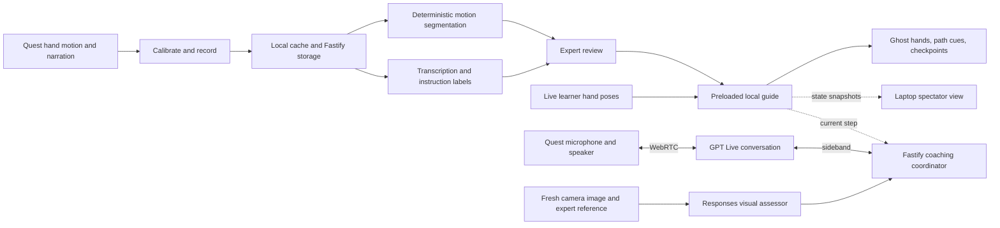

# Trail

**Record a physical task once. Follow the expert's movements in your own workspace, at your own pace.**

Trail is a planned mixed-reality physical-skill tutor for **Meta Quest 3S**,
developed for Hack the North 2026. An expert demonstrates a short task with
narration. Trail turns the recording into a reviewed tutorial, then guides a
different person with articulated ghost hands, spatial path cues, and movement
checkpoints aligned to their workspace.

**Current status:** runnable local application scaffold (the software portion of
TRAIL-02). The workspace includes a synthetic Three.js hand replay, recording
schemas, rigid transforms, a Fastify health route, unit/browser checks, and CI.
Recording, calibration, learner progression, persistence, live AI, pairing, and
headset validation remain planned. The experience below describes the target
product; the current screen is a diagnostic fixture.

**Selected headset stack:** Unity + Meta XR, using C#, Unity OpenXR,
Core/Interaction SDK and MRUK camera access. The native project is planned at
`apps/quest`; it does not exist yet. The current Three.js app remains a desktop
diagnostic. [The migration plan](docs/plan.md#unity-migration-sequence-owned-by-integration-and-xr)
preserves the web/server while adding native build, capture, guidance and voice.

## The experience

1. **Record.** The expert calibrates a marked mat, then performs and narrates a
   short task. Hand motion and audio share one recording timeline.
2. **Review.** Trail proposes movement boundaries and instruction labels. The
   expert adjusts the steps, active hand, and motion gates before saving the
   tutorial. Explicit markers provide a recovery path for authoring.
3. **Transfer.** A learner resets the parts and independently calibrates the
   same mat. The tutorial is preloaded onto the headset.
4. **Follow.** A translucent articulated ghost demonstrates each movement.
   Guidance responds to the learner's progress through the required motion
   gates and waits for a valid checkpoint hold before advancing.
5. **Talk and check.** Start a GPT Live conversation, then ask hands-free while
   working. “Am I doing this right?” checks a fresh scene image against the
   demonstrated step and gives spoken feedback. Repeat, Pause, and Resume stay
   local; guidance continues if AI or the server disconnects after preload.

The first two acceptance tasks are simple bottle and large LEGO-style assemblies
on a rigid marked mat. Each uses a fresh recording and reviewed expert images
through the same engine, without task-specific code. The storyboard's four-piece
stand is a fallback. Expert and learner use the same starting layout and dominant
hand within each tutorial. Three marks establish the workspace; a fourth checks alignment.

Trail combines **spatial motion guidance and spoken visual coaching**.
“Movement checkpoint reached” reports movement conditions. Camera feedback can
assess visible placement, with uncertainty; it cannot prove hidden attachment,
tightness, or a watertight seal. The [storyboard](docs/mockups/translucent-assembly-2026-09-19/guidance-sequence.png)
is the intended visual direction, not a headset-validated screenshot.

## Target architecture



| Layer | Planned technology and responsibility |
| --- | --- |
| Headset runtime/UI | Unity + Meta XR, OpenXR, C#, world-space controls and separate articulated ghost |
| Desktop UI | Existing TypeScript/Vite/HTML/CSS and Three.js for review, diagnostics and spectator |
| Wire contracts | Zod schemas and strict C# DTO validators; shared versioned JSON fixtures |
| Motion runtime | Pure C# headset engine; TypeScript offline authoring/math retained with golden fixtures |
| Backend | One Fastify process for uploads, storage, jobs, AI, and WebSocket relay |
| Persistence | Laptop files and Unity private-file cache; optional desktop IndexedDB |
| AI | Transcription/labels, GPT Live WebRTC conversation, and a separate Responses visual assessor |
| Verification | Existing web tests plus planned Unity EditMode/PlayMode, APK builds and real headset trials |

The Unity headset owns progression. AI supplies semantics, never authoritative spatial
coordinates or permission to advance a step. Shared motion logic receives time
and observations explicitly; rendering, network, audio, and hardware stay in
adapters. Calibration belongs to the current XR session and must be repeated
after a reference-space reset or session restart.

Unity supplies rendering/input components; Trail still implements recording,
calibration, motion matching and AI coaching. Native coordinate/joint mapping and
voice transport must pass the first standalone APK test; engine selection alone
is not hardware evidence.

GPT Live handles audio/text. Fresh native MRUK camera images go to a separate
image-capable Responses request, with its findings returned to voice. A paired
webcam is a development or disclosed reduced-demo source; headset-camera feedback
is the target. See the [Live and scene design](docs/plan.md#gpt-live-conversation-and-fresh-visual-coaching).

## Repository map

Available now:

- [plan.md](docs/plan.md) — product scope, contracts, algorithms, build sequence, and acceptance criteria.
- [team-plan.md](docs/team-plan.md) — four-person ownership, parallel assignments, handoffs, schedule, and integration gates.
- [AGENTS.md](AGENTS.md) — coding conventions, package boundaries, and agent workflow index.
- [.agents/skills/workflow/](.agents/skills/workflow/) — commit, PR, review, cleanup, verification, and QA skills.
- [.agents/references/validation.md](.agents/references/validation.md) — guidance for selecting and reporting evidence.

Application layout (module responsibilities beyond the scaffold remain planned):

```text
apps/quest/           Planned Unity headset app: capture, guidance, camera and native voice
apps/web/             Desktop review, synthetic replay and spectator UI
apps/server/          Fastify routes, storage, AI, and session relay
packages/contracts/  Versioned schemas and shared types
packages/motion/     Existing pure math; planned offline authoring/reference logic
fixtures/            Synthetic and explicitly approved real test recordings
tests/e2e/           Desktop browser acceptance flows
docs/                Device checks, contracts, demo instructions, and validation
data/                Private local recordings and generated assets; ignored by Git
```

## Development setup

Use Node **22.23.1** (see `.node-version`) and pnpm **11.3.0**. The dependency
versions are pinned exactly in the package manifests and one `pnpm-lock.yaml`.
The commands below describe the existing web/server scaffold. Unity requires a
separate editor, Android tooling and UPM lockfile; pnpm does not build the headset
app. Exact native setup and check commands are added when TRAIL-18 is implemented.

```sh
pnpm install --frozen-lockfile
cp .env.example .env
pnpm dev
```

Open `http://localhost:5173`. The synthetic fixture supports Play/Pause, Reset,
keyboard scrubbing, and an explicit tracking gap. It is diagnostic joint replay,
not live capture, an articulated hand mesh, or learner progression.

Vite binds to `127.0.0.1:5173` with a fixed port and proxies `/api` and `/ws` to
Fastify on `127.0.0.1:3001`. Only `/api/health` is implemented; the `/ws` proxy
reserves the future relay path. In the scaffold, keep `PORT=3001` for development.
Server startup loads the root `.env` regardless of the package working directory;
existing process environment values take precedence. Relative `DATA_DIR` paths
resolve from the repository root. No credentials are required. Unsupported live
AI/haptic modes fail configuration validation instead of reporting mock success.
Provider keys must never enter `VITE_*` variables or client bundles.

For separate web and server terminals, first run `pnpm build:shared`, then:

```sh
# Terminal 1: shared package watchers and web
pnpm exec concurrently -k "pnpm dev:shared" "pnpm --filter @trail/web dev"
# Terminal 2: API
pnpm --filter @trail/server dev
```

| Command | Purpose |
| --- | --- |
| `pnpm dev` | Build shared packages, then start shared/web/server watchers |
| `pnpm check` | Strict typecheck (including tests/config), unit tests, production build |
| `pnpm test` | Contract, pure motion, architecture boundary, and Fastify checks; build shared packages first |
| `pnpm validate:fixtures` | Build shared packages and validate the committed synthetic recording |
| `pnpm test:e2e` | Test the **built** application on port 3101; run `pnpm build` or `pnpm check` first |
| `pnpm build` | Build shared ESM/declarations, web assets, and server |
| `pnpm start` | Serve built assets and API together on `http://localhost:3001` |

Install the browser once before desktop end-to-end tests:

```sh
pnpm exec playwright install chromium
pnpm check
pnpm test:e2e
```

CI installs Chromium with its Linux dependencies, runs the same checks, and
retains failure traces. No secrets or headset are needed. See
[scaffold notes](docs/scaffold.md) for module entry points, scope, and evidence;
[contracts](docs/contracts.md) describes the implemented subset and version policy.

### Quest connection

Hardware is **Meta Quest 3S with controllers**. Native setup remains planned:
install Unity with Android build support, create the pinned OpenXR/Meta project,
build an ARM64 APK and install it using ADB/MQDH. Controllers do not substitute
for bare-hand capture. See [the setup plan](docs/plan.md#device-connection-and-runtime-validation)
and [pending device gate](docs/device-check.md).

For the planned wired API path, `adb reverse tcp:3001 tcp:3001` connects the
installed app to the laptop Fastify server. Native pairing, scoped development
cleartext policy and camera/mic permissions must be implemented and tested first.
Opening the existing site in Quest Browser remains only a scaffold diagnostic;
it does not launch the Unity app. Keep the unpaired scaffold on loopback.

## Build milestones

The goal is a polished four-step experience. The minimum demo is an intermediate
recovery milestone, with any reduced capabilities disclosed.

| Milestone | Required evidence |
| --- | --- |
| Workspace and device baseline | Reproducible install/check, desktop fixture, headset health and AR entry |
| Unity migration | Pinned editor/SDKs, standalone APK, C#/TS fixture compatibility, preserved web checks, native hand/camera/audio proof |
| Spatial proof | Fresh real hand recording replays after a second person's independent calibration |
| One interactive step | Learner advances at their own pace; tracking loss cannot falsely complete a step |
| Multi-step transfer | Fresh 3–5-step recording saves/reloads; required motion gates cannot be skipped |
| Natural authoring and coaching | Reviewed steps/references, GPT Live conversation and fresh-scene feedback work on headset |
| Reusable engine | Two freshly recorded task families work without application code changes |
| Quality and acceptance | Clear articulated ghost and feedback, finished review/spectator UI, recovery drills, three clean runs, and a non-builder trial |

Implementation tickets and dependencies live in
[plan section 17](docs/plan.md#17-immediate-tickets-to-create). Live conversation
and bounded scene inspection are core targets; additional sponsor integrations,
continuous video analysis and real haptics follow the quality gates.

## Validation and limits

Current automated checks cover recording validation, transform round trips,
shared-package boundaries, health/storage failures, static serving, and desktop
fixture controls. Calibration, slow learners, ordered gates, dwell, stale replies,
uploads, persistence, and reconnect checks remain tied to later implementation. Desktop fixtures cannot establish real hand accuracy,
cross-user alignment, simultaneous microphone/XR/casting behavior, or usability.

Record actual device results separately in `docs/validation.md` when testing
starts, including the commit, device/software versions, scenario, measurements,
and remaining issues. The complete criteria are in
[plan section 11](docs/plan.md#11-verification-strategy-and-acceptance-checklist).

- Guidance must pause safely on tracking loss, session interruption, or invalid
  calibration. It must never advance from stale poses or elapsed time in a gap.
- Continuing a preloaded guide without the backend is a design requirement;
  cold offline native startup is a separate unverified acceptance case.
- Manual labels, explicit markers, controller-only replay, and fixtures retain
  their provenance and cannot stand in for untested target capabilities.
- Raw narration, camera frames, personal recordings, and secrets stay out of
  Git and logs. Real fixtures require deliberate consent and review.
- Arbitrary object tracking, physical assembly verification, dangerous tasks,
  persistent cloud anchors, and remote multiplayer are outside the scope.

## Contributing

Read [AGENTS.md](AGENTS.md) before changing the repository. Use
`codex/<bounded-task>` branches, keep changes within the relevant workstream,
and coordinate shared-schema and dependency changes. The repository includes
Trail-specific skills for commits, PR creation, staff review, branch catch-up,
PR feedback, signoff, cleanup, manual QA, and plan critique, with discovery links
for Claude and Cursor.
