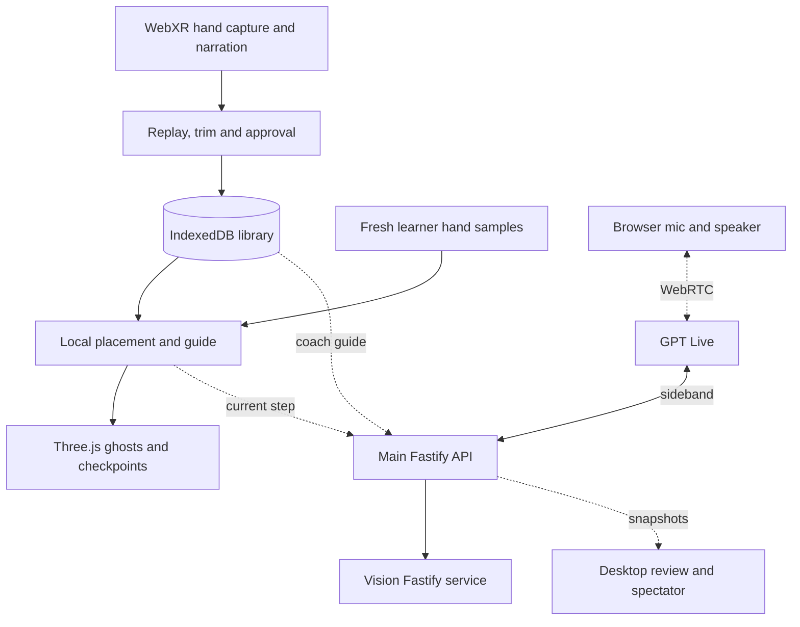

# Trail

**Record a physical task once. Follow the expert's movements in your own workspace, at your own pace.**

Trail is a mixed-reality physical-skill tutor for **Meta Quest 3S**, built on
**Quest Browser, WebXR and Three.js**. An expert demonstrates a short task with
tracked hands; a learner later follows translucent ghost hands and movement
checkpoints in their own workspace. Voice coaching and narration drafting come
from a paired backend.

Quest Browser / WebXR is the product foundation, carried forward from
[PR #17](https://github.com/aidanjnn/teachAR/pull/17) →
[PR #23](https://github.com/aidanjnn/teachAR/pull/23) →
[PR #24](https://github.com/aidanjnn/teachAR/pull/24). The earlier Unity
implementation is retired; its history remains in Git and the
[development log](docs/codex-log.md).

**Docs:** [implementation plan](docs/plan.md) ·
[web delivery status][web-delivery] · [WebXR tutor guide][browser-guide] ·
[device checklist](docs/device-check.md) · [CI](docs/ci.md) ·
[OpenAI track brief](docs/openai-track.md) · [contributor guide](AGENTS.md)

## Quick start

Requires Node.js 22 ([.node-version](.node-version)), pnpm 11.3.0 and
Python 3.12+ with `venv`/pip. macOS and Linux only (the launchers use `sh`).

```sh
git clone https://github.com/aidanjnn/teachAR.git
cd teachAR
npm install --global pnpm@11.3.0   # skip if already installed
pnpm install --frozen-lockfile
pnpm dev                           # WebXR tutor on http://127.0.0.1:4321/tutorial
```

The first `pnpm dev` creates a Python virtual environment and copies the pinned
Three.js assets with hash and license checks. Desktop browsers can inspect the
library and review UI; hand tracking and AR need the headset.

### On the Quest

Enable developer mode, connect USB, accept debugging and confirm
`adb devices -l` shows the headset. Then, in another terminal:

```sh
pnpm quest:open    # adb reverse tcp:4321 and open /tutorial in Quest Browser
```

Choose **Enter the experience**, then **Create tutorial** or **Follow tutorial**.
Hand recording and ghost guidance need no camera or API key. Use
`PORT=4331 pnpm dev` and `PORT=4331 pnpm quest:open` for another port.

### With voice coaching

Voice coaching and narration drafting run through the main API, which serves the
same tutor source:

```sh
pnpm build
ALLOW_USB_LOOPBACK=true PAIRING_ORIGINS=http://localhost:3001 pnpm dev:desktop
adb reverse tcp:3001 tcp:3001      # then open http://localhost:3001/tutorial
```

The tutor then asks for a pairing code. Each API start writes a fresh single-use
browser author code to `data/pairing.json`, valid for five minutes; enter it on
the Quest. To pair more devices, use that code on the laptop's authoring page at
`http://localhost:3001/` instead, then choose **New device: Author**,
**Client: Browser** and **Create pairing code**. The dev page on port 5173 is not
an allowed pairing origin in this setup. See [pairing](docs/pairing.md).

Mock mode needs no credentials and answers in text. Live voice needs
`AI_PROVIDER=openai` and a server-side `OPENAI_API_KEY` in the root `.env`
(see [.env.example](.env.example)); keys never reach browser assets or exports.
Rehearse with the [voice demo checklist](docs/voice-demo-checklist.md).

## How it works

1. **Record.** In AR, place the workspace, record tracked hands step by step
   (pause/resume between actions) and optionally attach narration and photos.
2. **Review.** Replay, trim, edit instructions, choose the required hands and
   approve each step. Saving completes only after the durable IndexedDB write.
3. **Place.** The learner restores the same objects and starting layout, then
   places the tutorial with an origin and heading at its original scale.
4. **Follow.** *Repeat & practise* (default) loops the ghost with untimed palm
   feedback. *Guided movement* previews each step, waits at a start gate, checks
   ordered movement targets, then previews the next step automatically.
5. **Ask.** The paired voice coach answers from the reviewed step text, and
   exact spoken commands such as “next step” are applied locally.

“Movements finished” means the movements were followed. Grasp, contact,
attachment and other physical results are **not** verified.

## Status

| Area | In source | Still needed |
| --- | --- | --- |
| Quest Browser tutor (`apps/webxr`) | Create/Follow UI, tracked-hand capture, review/trim, local library, rigid placement, ghosts, practice and guided modes, local spoken controls | Headset tuning, recovery and independent transfer acceptance |
| Voice coach | Paired step-text coaching, narration title drafts, GPT Live over WebRTC | Concurrent mic + WebRTC + immersive hands on Quest |
| Desktop (`apps/web`) | Replay diagnostics, authoring/review, spectator tools, Voice Lab | Presentation polish |
| Main API (`apps/server`) | Scoped pairing, recording/tutorial storage, voice routes, inspection coordination | Fresh visual coaching |
| Vision (`apps/vision`) | Authenticated, bounded inspection jobs; mock provider by default | Live-model and fresh-headset-image acceptance |
| Shared packages | Zod contracts, fixtures, rigid transforms, authoring logic | Versioned adapter between browser and API formats |

Health endpoints report reachability, not provider or headset readiness. See
[web delivery status][web-delivery] for the full inventory.

## Architecture


```mermaid
flowchart TB
    Capture[WebXR hand capture and narration] --> Review[Replay, trim and approval]
    Review --> Library[(IndexedDB library)]
    Library --> Guide[Local placement and guide]
    Hands[Fresh learner hand samples] --> Guide
    Guide --> Ghost[Three.js ghosts and checkpoints]
    Library -. coach guide .-> API[Main Fastify API]
    Guide -. current step .-> API
    Audio[Browser mic and speaker] <-. WebRTC .-> Live[GPT Live]
    Live <-->|sideband| API
    API --> Vision[Vision Fastify service]
    API -. snapshots .-> Desktop[Desktop review and spectator]
```

- **The headset browser owns progression.** AI supplies instructions and
  advisory findings; it cannot invent coordinates, change tolerances or
  complete a step. Spoken navigation is allowlisted and revalidated locally.
- **Two formats.** The browser stores `trail.tutorial.prototype.v3`; the shared
  API uses its own v1 recording/tutorial schemas. Never pass one as the other
  without a validated, versioned adapter.
- **Local first.** Loaded guidance keeps working without AI or the backend.
  Browser storage is per device and origin; use export/import to move tutorials.
- **Loopback only.** The Python dev server and default API bind to loopback.
  Remote hosting needs HTTPS and a deliberate authenticated deployment.

## Repository layout

| Path | Role |
| --- | --- |
| `apps/webxr/` | Quest Browser tutor: capture, review, library, placement, ghosts, guidance ([guide][browser-guide]) |
| `apps/web/` | Desktop replay, authoring, spectator tools and Voice Lab |
| `apps/server/` | Main API: pairing, storage, voice and inspection coordination |
| `apps/vision/` | Separate visual inspection service ([setup](apps/vision/README.md)) |
| `packages/contracts/` | Zod wire schemas and versioned fixtures |
| `packages/motion/` | Pure motion math and offline authoring logic |
| `fixtures/`, `tests/e2e/` | Synthetic fixtures and desktop Playwright tests |
| `experiments/` | Optional offline detector spike |
| `docs/` | Plans, design references, checklists and the development log |

## Commands

| Command | What it does |
| --- | --- |
| `pnpm dev` | WebXR tutor on port 4321 (alias: `pnpm dev:xr`, `pnpm start`) |
| `pnpm quest:open` | Start/reuse the tutor and open it on a USB-connected Quest |
| `pnpm setup:webxr` | Prepare Python dependencies and verified Three.js assets |
| `pnpm dev:desktop` | Desktop (5173), main API (3001), vision (3002) and watchers |
| `pnpm dev:web` | Desktop, main API and watchers, without vision |
| `pnpm build` | Build shared packages, desktop, both backends and WebXR assets |
| `pnpm start:server` / `pnpm start:vision` | Run the built main API / vision service |
| `pnpm check` | Typecheck, unit/API tests and builds |
| `pnpm validate:fixtures` | Validate recording fixtures |
| `pnpm test:e2e` | Desktop Playwright tests (run `pnpm build` first) |
| `pnpm test:webxr` | WebXR Node, Python and isolated browser tests |

Occupied ports fail fast. For an isolated stack use
`PORT=3201 DEV_WEB_PORT=5273 VISION_PORT=3202 pnpm dev:desktop`.

## Testing

```sh
pnpm exec playwright install chromium   # Linux: add --with-deps if needed
pnpm check
pnpm validate:fixtures
pnpm build && pnpm test:e2e
pnpm setup:webxr && pnpm test:webxr
```

These need no provider credentials, and CI runs them on every pull request
([docs/ci.md](docs/ci.md)). Synthetic tests do not establish physical transfer,
novice success or concurrent voice/camera/hand reliability; record headset
results with the [device checklist](docs/device-check.md).

### Troubleshooting

| Symptom | Check |
| --- | --- |
| Frozen install fails | Match `.node-version`, the pnpm version in `package.json` and the committed lockfile. |
| Python setup fails | Use Python 3.12+ with `venv` and pip, then rerun `pnpm setup:webxr`. `TRAIL_PYTHON` selects an interpreter. |
| Quest missing from `adb devices` | Enable developer mode, accept USB debugging, check the cable. |
| Tutor does not load on Quest | Keep the server running and USB connected; check port forwarding and the `/tutorial` path. |
| Tutorials seem missing | Return to the original origin (host and port) or import an export. |

## Contributing

Read [AGENTS.md](AGENTS.md) first. Keep keys, camera frames, raw narration and
personal recordings out of Git. Keep exact dependency pins and
`pnpm-lock.yaml`, use Conventional Commits, and record substantive changes in
[the development log](docs/codex-log.md). Choose checks with
[the validation guide](.agents/references/validation.md).

[browser-guide]: apps/webxr/README.md
[web-delivery]: docs/web-delivery.md
