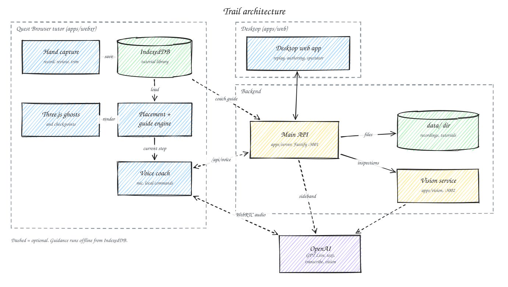

# Trail

**Record a physical task once. Follow the expert's movements in your own workspace, at your own pace.**

<p align="center">
  <a href="https://www.youtube.com/watch?v=roAt7l1E0Kc">
    
    <br>
    <em>▶ Watch the demo on YouTube</em>
  </a>
</p>

Trail is a mixed-reality tutor for physical skills. It runs on **Meta Quest 3S**
in **Quest Browser** using **WebXR and Three.js**. An expert demonstrates a short
task with tracked hands. Later, a learner follows translucent ghost hands and
movement checkpoints in their own workspace. Recording and guidance work
entirely in the headset browser. An optional paired backend adds voice coaching,
narration drafting, shared storage and desktop review.

The product is built on Quest Browser and WebXR, carried forward from
[PR #17](https://github.com/aidanjnn/teachAR/pull/17) →
[PR #23](https://github.com/aidanjnn/teachAR/pull/23) →
[PR #24](https://github.com/aidanjnn/teachAR/pull/24). The earlier Unity
implementation is retired; its history remains in Git and the
[development log](docs/codex-log.md).

**Docs:** [implementation plan](docs/plan.md) ·
[web delivery status][web-delivery] · [WebXR tutor guide][browser-guide] ·
[device checklist](docs/device-check.md) · [pairing](docs/pairing.md) · [CI](docs/ci.md) ·
[OpenAI track brief](docs/openai-track.md) · [contributor guide](AGENTS.md)

## Architecture



- **Hand capture** (`apps/webxr/public`): in AR, the expert places the workspace,
  then records tracked hands step by step with optional narration and photos.
  Each step is replayed, trimmed, edited and approved before saving.
- **IndexedDB library**: tutorials are stored per device and origin in the
  `trail-tutorials` database as `trail.tutorial.prototype.v3`. A save completes
  only after the IndexedDB write commits. Use export/import to move tutorials
  between devices.
- **Placement and guide engine**: the learner restores the same objects and
  layout, then places the tutorial with an origin and heading at its original
  scale. Fresh learner hand samples are checked against ordered movement
  targets. Progression always happens on the headset.
- **Three.js ghosts**: translucent hands and checkpoints show the expert's
  movement in the learner's space.
- **Voice coach**: the browser applies exact spoken commands (for example
  “next step”) locally. Open-ended questions go to the main API, and live voice
  runs as WebRTC audio to GPT Live.
- **Main API** (`apps/server`, Fastify on 127.0.0.1:3001): handles scoped device
  pairing, recording and tutorial storage under `data/`, voice and coach routes
  (`/api/voice/*`, `/api/coach`, `/api/live/sessions`), a trusted GPT Live
  sideband, a WebSocket relay for spectators, and the built `/tutorial`.
- **Vision service** (`apps/vision`, Fastify on 127.0.0.1:3002): runs
  authenticated, bounded image-inspection jobs for the main API. It uses a mock
  provider by default.
- **Desktop web app** (`apps/web`, Vite on 5173): replay diagnostics,
  authoring and review, spectator tools and Voice Lab.

Design rules:

- **The headset owns progression.** AI supplies instructions and advisory
  findings. It cannot invent coordinates, change tolerances or complete a step.
  Spoken navigation is allowlisted and revalidated locally.
- **Two formats.** The browser stores `trail.tutorial.prototype.v3`, and the
  shared API uses its own v1 recording and tutorial schemas
  (`packages/contracts`). Never pass one as the other without a validated,
  versioned adapter.
- **Local first.** Loaded guidance keeps working without AI or the backend.
- **Loopback only.** The Python dev server and the APIs bind to loopback.
  Remote hosting needs HTTPS and a deliberate authenticated deployment.

## Features

1. **Record.** Capture tracked hands step by step in AR, with pause/resume
   between actions and optional narration and photos.
2. **Review.** Replay and trim steps, edit instructions, choose the required
   hands and approve each step.
3. **Place.** Restore the starting layout and anchor the tutorial with an origin
   and heading at its original scale.
4. **Follow.** *Repeat & practise* (the default) loops the ghost with untimed
   palm feedback. *Guided movement* previews each step, waits at a start gate,
   checks ordered movement targets, then previews the next step.
5. **Ask.** The paired voice coach answers from the reviewed step text and
   drafts narration titles. Exact spoken commands are handled on the device.

“Movements finished” means the learner followed the movements. Grasp, contact,
attachment and other physical results are **not** verified.

### Status

| Area | In source | Still needed |
| --- | --- | --- |
| Quest Browser tutor (`apps/webxr`) | Create/Follow UI, tracked-hand capture, review/trim, local library, rigid placement, ghosts, practice and guided modes, local spoken controls | Headset tuning, recovery and independent transfer acceptance |
| Voice coach | Paired step-text coaching, narration title drafts, GPT Live over WebRTC | Concurrent mic + WebRTC + immersive hands on Quest |
| Desktop (`apps/web`) | Replay diagnostics, authoring/review, spectator tools, Voice Lab | Presentation polish |
| Main API (`apps/server`) | Scoped pairing, recording/tutorial storage, voice routes, inspection coordination | Fresh visual coaching |
| Vision (`apps/vision`) | Authenticated, bounded inspection jobs; mock provider by default | Live-model and fresh-headset-image acceptance |
| Shared packages | Zod contracts, fixtures, rigid transforms, authoring logic | Versioned adapter between browser and API formats |

Health endpoints report reachability only. They do not report provider or
headset readiness. See [web delivery status][web-delivery] for the full inventory.

## Tech stack

- **Headset client:** WebXR, Three.js 0.186 (vendored with hash and license
  checks), plain ES modules, IndexedDB, Web Audio, WebRTC
- **Tutor dev server:** Python 3.12+ (`apps/webxr/server.py`)
- **Backend:** Node.js 22, TypeScript, Fastify 5 (`@fastify/static`,
  `@fastify/websocket`), Zod 4, sharp, the OpenAI SDK
- **Desktop:** Vite 8, Three.js, TypeScript
- **Shared:** `@trail/contracts` (Zod wire schemas and fixtures),
  `@trail/motion` (motion math and offline authoring)
- **Tooling:** pnpm 11 workspaces, Vitest, Playwright, optional Sentry
  browser telemetry

## Getting started

You need Node.js 22 ([.node-version](.node-version)), pnpm 11.3.0 and
Python 3.12+ with `venv` and pip. Only macOS and Linux are supported, because
the launchers use `sh`.

```sh
git clone https://github.com/aidanjnn/teachAR.git
cd teachAR
npm install --global pnpm@11.3.0   # skip if already installed
pnpm install --frozen-lockfile
pnpm dev                           # WebXR tutor on http://127.0.0.1:4321/tutorial
```

The first `pnpm dev` creates a Python virtual environment and copies the pinned
Three.js assets with hash and license checks. On a desktop browser you can
inspect the library and the review UI, but hand tracking and AR need the
headset.

### On the Quest

Enable developer mode, connect the headset over USB, accept USB debugging and
check that `adb devices -l` lists it. Then, in another terminal:

```sh
pnpm quest:open    # adb reverse tcp:4321 and open /tutorial in Quest Browser
```

Choose **Enter the experience**, then **Create tutorial** or **Follow tutorial**.
Hand recording and ghost guidance need no camera or API key. To use another
port, run `PORT=4331 pnpm dev` and `PORT=4331 pnpm quest:open`.

### With voice coaching

Voice coaching and narration drafting run through the main API, which also
serves the tutor:

```sh
pnpm build
ALLOW_USB_LOOPBACK=true PAIRING_ORIGINS=http://localhost:3001,http://127.0.0.1:5173 pnpm dev:desktop
adb reverse tcp:3001 tcp:3001      # then open http://localhost:3001/tutorial
```

The tutor then asks for a pairing code. Each time the API starts, it writes a
fresh single-use browser author code to `data/pairing.json`. The code is valid
for five minutes; enter it on the Quest. To pair more devices, open the desktop
authoring page at `http://127.0.0.1:5173` (allowed by the second
`PAIRING_ORIGINS` entry). Choose **New device: Author**, **Client: Browser**,
then **Create pairing code**. See [pairing](docs/pairing.md).

Mock mode needs no credentials and answers in text. Live voice needs
`AI_PROVIDER=openai` and a server-side `OPENAI_API_KEY` in the root `.env`
(copy [.env.example](.env.example)). Keys never reach browser assets or exports.
Rehearse with the [voice demo checklist](docs/voice-demo-checklist.md).

### Environment variables

The main API and vision service read these from the root `.env`:

| Scope | Variables |
| --- | --- |
| Main API | `HOST`, `PORT`, `DATA_DIR`, `BUILD_ID`, `AI_PROVIDER`, `HAPTICS_DRIVER`, `PAIRING_ORIGINS`, `ALLOW_USB_LOOPBACK`, `TLS_CERT_FILE`, `TLS_KEY_FILE` |
| OpenAI (when `AI_PROVIDER=openai`) | `OPENAI_API_KEY`, `OPENAI_TRANSCRIBE_MODEL`, `OPENAI_TEXT_MODEL`, `OPENAI_LIVE_MODEL`, `OPENAI_LIVE_BACKEND_MODEL`, `OPENAI_LIVE_VOICE`, `OPENAI_LIVE_GREETING` |
| Vision link | `VISION_SERVICE_URL`, `VISION_SERVICE_TOKEN` (`pnpm dev:desktop` generates a token if blank) |
| Vision service | `VISION_HOST`, `VISION_PORT`, `VISION_PROVIDER`, `VISION_MODEL`, `OPENAI_API_KEY` |
| Browser telemetry | `SENTRY_ENABLED`, `SENTRY_BROWSER_DSN`, `SENTRY_REPLAY_ENABLED`, `SENTRY_ENVIRONMENT`, `SENTRY_RELEASE`, `SENTRY_TRACES_SAMPLE_RATE` |
| Dev launchers | `DEV_WEB_PORT`, `OPENAI_API_KEY_FILE`, `TRAIL_PYTHON`, `TRAIL_RUNTIME_DIR` |

### Commands

| Command | What it does |
| --- | --- |
| `pnpm dev` | WebXR tutor on port 4321 (aliases: `pnpm dev:xr`, `pnpm start`) |
| `pnpm quest:open` | Start or reuse the tutor and open it on a USB-connected Quest |
| `pnpm setup:webxr` | Prepare Python dependencies and verified Three.js assets |
| `pnpm dev:desktop` | Desktop (5173), main API (3001), vision (3002) and watchers |
| `pnpm dev:web` | Desktop, main API and watchers, without vision |
| `pnpm build` | Build shared packages, desktop, both backends and WebXR assets |
| `pnpm start:server` / `pnpm start:vision` | Run the built main API or vision service |
| `pnpm check` | Typecheck, unit/API tests and builds |
| `pnpm validate:fixtures` | Validate recording fixtures |
| `pnpm test:e2e` | Desktop Playwright tests (run `pnpm build` first) |
| `pnpm test:webxr` | WebXR Node, Python and isolated browser tests |

If a port is already in use, the launcher stops immediately. For an isolated
stack, run `PORT=3201 DEV_WEB_PORT=5273 VISION_PORT=3202 pnpm dev:desktop`.

### Testing

```sh
pnpm exec playwright install chromium   # Linux: add --with-deps if needed
pnpm check
pnpm validate:fixtures
pnpm build && pnpm test:e2e
pnpm setup:webxr && pnpm test:webxr
```

These tests need no provider credentials, and CI runs them on every pull request
([docs/ci.md](docs/ci.md)). Synthetic tests do not prove physical transfer,
novice success or reliable concurrent voice, camera and hand tracking. Record
headset results with the [device checklist](docs/device-check.md).

### Troubleshooting

| Symptom | Check |
| --- | --- |
| Frozen install fails | Match `.node-version`, the pnpm version in `package.json` and the committed lockfile. |
| Python setup fails | Use Python 3.12+ with `venv` and pip, then rerun `pnpm setup:webxr`. `TRAIL_PYTHON` selects an interpreter. |
| Quest missing from `adb devices` | Enable developer mode, accept USB debugging, check the cable. |
| Tutor does not load on Quest | Keep the server running and USB connected; check port forwarding and the `/tutorial` path. |
| Tutorials seem missing | Return to the original origin (host and port) or import an export. |

## Project structure

```
apps/
  webxr/        Quest Browser tutor: public/ ES modules + Python dev server (guide: apps/webxr/README.md)
  web/          Desktop replay, authoring, spectator tools and Voice Lab (Vite)
  server/       Main API: auth/, storage/, routes/, ai/, vision/, sessions/
  vision/       Separate visual inspection service (apps/vision/README.md)
packages/
  contracts/    Zod wire schemas and versioned fixtures
  motion/       Pure motion math and offline authoring logic
fixtures/       Synthetic recording and guide fixtures
tests/e2e/      Desktop Playwright tests
scripts/        Dev launcher, headset start, fixture validation
experiments/    Optional offline detector spike
docs/           Plans, design references, checklists, development log, architecture diagram
```

## Contributing

Read [AGENTS.md](AGENTS.md) first. Keep keys, camera frames, raw narration and
personal recordings out of Git. Keep exact dependency pins and
`pnpm-lock.yaml`, use Conventional Commits, and record substantive changes in
[the development log](docs/codex-log.md). Choose checks with
[the validation guide](.agents/references/validation.md).

[browser-guide]: apps/webxr/README.md
[web-delivery]: docs/web-delivery.md
