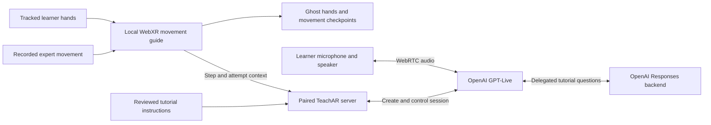

# TeachAR: OpenAI track brief and demo plan

**Teach a physical skill once. Give the next learner an expert's movements and a voice they can question.**

TeachAR combines recorded hand motion, translucent guides and GPT-Live conversation
so a learner can ask for help while working with real objects. The most compelling
demo is one short task, a real learner and an unexpected question answered from
the tutorial they are following.

This brief maps to the two criteria supplied by the team: effective, creative
OpenAI API use, and a concrete improvement made with Codex. The priorities below
are recommendations, not additional competition rules or a prediction of placement.

## Source and claim boundaries

Reviewed September 20, 2026 against main at
[`dfaf572`](https://github.com/aidanjnn/trail/tree/dfaf572a0c4bb1eb0ce15a14605649306fa550fe).
That snapshot uses Quest Browser/WebXR in `apps/webxr`. Source links below
intentionally pin the inspected implementation, even as main advances. Neither
this document nor old logs establish which revision is running on the demo headset.

The team reports using GPT-Live and Codex for implementation. Source inspection
confirms the API integration; recorded desktop provider tests add narrower runtime
evidence. Concurrent Quest speech, WebXR hands and usable spoken answers still need
an attached rehearsal result for the selected demo build.

## What the API contributes

| Experience | Implementation inspected | What to demonstrate |
| --- | --- | --- |
| Ask about the current movement | GPT-Live over WebRTC; the paired server loads reviewed instructions, current step and attempt context. | Speak an unscripted question, hear a useful reply, then repeat after changing steps. |
| Explain a relationship between steps | The Live session configures a Responses backend for questions that compare steps. No application tools are registered in this session configuration. | Use a question whose answer is actually in the approved tutorial; only claim delegation if observed. |
| Turn expert narration into editable instructions | Audio transcription plus structured Responses output; drafts retain model provenance and require review. | If rehearsed, record a short instruction, generate a draft, then correct and approve it. |
| Check visible placement | A separate vision-service Responses adapter accepts a current image and labelled expert references. | Stretch goal: only show after fresh camera input changes the answer heard by the learner. Source existence alone does not prove this loop. |

Source: [Live session configuration](https://github.com/aidanjnn/trail/blob/dfaf572a0c4bb1eb0ce15a14605649306fa550fe/apps/server/src/ai/openai.ts),
[SDK calls](https://github.com/aidanjnn/trail/blob/dfaf572a0c4bb1eb0ce15a14605649306fa550fe/apps/server/src/ai/openai-gateway.ts),
[coach prompts](https://github.com/aidanjnn/trail/blob/dfaf572a0c4bb1eb0ce15a14605649306fa550fe/apps/server/src/ai/coach-prompts.ts),
[browser bridge](https://github.com/aidanjnn/trail/blob/dfaf572a0c4bb1eb0ce15a14605649306fa550fe/apps/webxr/public/tutorial-coach.mjs),
[vision adapter](https://github.com/aidanjnn/trail/blob/dfaf572a0c4bb1eb0ce15a14605649306fa550fe/apps/vision/src/provider.ts).

The inspected defaults are `gpt-live-1` for voice, `gpt-5.6-luna` for its
delegated backend, `whisper-1` for transcription and `gpt-4.1-mini-2025-04-14`
for text/labels. These are
[configuration defaults](https://github.com/aidanjnn/trail/blob/dfaf572a0c4bb1eb0ce15a14605649306fa550fe/apps/server/src/config.ts),
not proof of the models used by a particular running session. Record the actual
model IDs during rehearsal without exposing credentials.

This diagram describes the implemented voice configuration; the separate visual
inspection extension is not drawn as a completed demo path. The guide controls
movement progression locally. The model explains approved instructions and cannot
mark a physical result correct. Keys stay on the server.

Use the name **GPT-Live** in the pitch: the inspected code calls `client.live.create`.
OpenAI documents its conversation and delegation roles in the
[GPT-Live guide](https://developers.openai.com/api/docs/guides/live).
Visual context goes to a vision-capable backend; the Live audio frontend does not
accept images directly. See
[visual delegation](https://developers.openai.com/api/docs/guides/live-delegation#add-images-and-visual-context)
and [Responses image inputs](https://developers.openai.com/api/docs/guides/images-vision).

## The Codex contribution to put on stage

> During development, Codex reproduced a bug where stationary hands could finish
> a recorded movement because the target regions overlapped. It added a failing
> regression, changed the guide to require observed movement, and checked that
> tracking loss could not earn progress. That made the core learning interaction
> more trustworthy.

Show the [before/after evidence](codex-impact.md#1-stationary-hands-could-finish-a-movement)
for 20–30 seconds. It connects Codex's implementation and debugging work to a
visible product outcome. The fresh check reproduced the old failure, passed all
12 follower tests at the repair commit, and passed 32 focused movement/coach tests
at the inspected main revision. These are synthetic automated tests.

The team supplied the product goals, constraints, review feedback and physical
observations. Codex helped research, implement, reproduce failures, repair code,
test and integrate the result. Explain one of those decisions in your own words;
avoid unsupported percentages of generated code or invented hours saved.

## Suggested three-minute demo

Three minutes is a rehearsal assumption; shorten to the organizer's actual limit.
Choose a forgiving two- or three-step task with large lightweight objects. Use
the best rehearsed task instead of adding a new difficult task for judging.

| Time | Show | Say or establish |
| --- | --- | --- |
| 0:00–0:15 | The real object, learner and mirrored headset view. | “Video tutorials make you look away. TeachAR puts the demonstration in your workspace and lets you question it.” |
| 0:15–0:45 | Record one short movement and preview it, or clearly load a previously recorded tutorial. | Establish where the ghost movement came from. |
| 0:45–1:25 | Learner follows a movement, uses Ask coach and speaks a question about the current instruction. | Make the reply audible to judges. Explain why the answer helps this learner continue. |
| 1:25–1:45 | Ask for a simpler explanation or interrupt and clarify, if rehearsed. | Demonstrate an adaptive exchange that recorded narration cannot provide. |
| 1:45–2:05 | Show the small architecture diagram. | “GPT-Live handles conversation; our server supplies the reviewed tutorial and current step. Local tracking owns movement checkpoints.” |
| 2:05–2:35 | Open the stationary-hand regression and repair. | Deliver the concrete Codex story above. |
| 2:35–3:00 | Return to the learner finishing the movement. | State the observed outcome and the next validation gap in one sentence. |

Current browser voice is **Ask-triggered**; its historical handoff says the
microphone opens for one question. Do not describe that build as always listening.
The current text question box uses a text-answer path; a typed response does not
prove GPT-Live speech worked. The 1.7-second result in the historical provider
smoke was session startup, not spoken answer latency.

## Highest-value improvements, in order

These are proposed work and rehearsal priorities, not features implemented by
this documentation update.

1. **Prove the existing voice-and-hands moment.** Rehearse three complete runs on
   the actual headset/network with audible answers. Keep captions readable for
   judges. Measure end-of-question to first useful audible answer. This is the
   highest priority because it demonstrates the API doing useful work.
2. **Make the question specific to the demonstration.** Review clear step text
   and include one meaningful reason for a movement. Ask the coach to rephrase
   that reason, then show the learner act on the answer. The current prompt is
   deliberately grounded in the tutorial, so the relevant fact must be there.
3. **Let someone else try it.** A teammate who did not build the flow, or a
   willing judge, follows one short step and chooses the question. Record whether
   they needed help. One successful trial is a trial, not a general learning claim.
4. **Show narration becoming a reusable lesson.** If the authoring path is stable,
   demonstrate narration → editable draft → approved step → learner question.
   This connects API use across creation and learning without adding a new service.
5. **Consider one visual coaching moment only after the core passes.** Show a
   visible mismatch, then an obscured view that produces uncertainty. This needs
   real fresh-image-to-spoken-result integration; the current voice-only prompt
   explicitly says it cannot see the parts. Update and validate the full path
   before claiming the coach can inspect them.

Additional model names, sponsor integrations and document volume do not by
themselves demonstrate either supplied judging criterion. A clear exchange and
a proven Codex fix make stronger evidence.

## Rehearsal evidence to collect

Keep one short record per run: commit and local changes; headset/browser/OS;
server and actual model IDs; task and participant role; input source; question;
observed answer and action; interruptions; time to first useful speech; failures.
Keep consented recordings private unless the participant approves sharing.
Add real device observations to `docs/validation.md` when collected.

| Check | Result to enter after rehearsal |
| --- | --- |
| Three consecutive complete runs | Not measured by this documentation task |
| Actual headset microphone → API → audible headset reply while hands run | Not tested by this documentation task |
| Answer uses the new current step after a transition | Record actual observation |
| Interruption, Stop and restart leave no stale reply | Record actual observation |
| Non-builder completes one step without coaching from the team | Record actual observation |
| End-of-question → first useful speech | Record each sample and median; do not substitute session startup |

Prepare a clearly labelled backup recording from the same tested revision. If
the network fails, disclose the switch to recorded footage. Open this brief,
the [Codex case study](codex-impact.md) and the
[full activity log](codex-log.md) before judging; the live product should receive
most of the demo time.
