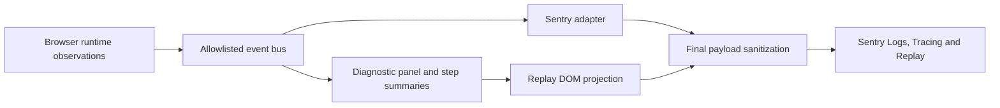

# TeachAR × Sentry

**Making a spatial tutor explain where an interaction stopped—without recording the learner's room.**

TeachAR lets an expert record a physical movement and a learner follow ghost hands
at their own pace in Quest Browser. When a spatial control appears unresponsive,
an exception alone cannot explain whether targeting failed, dispatch was rejected,
the application waited, or the UI changed. We built an observatory around those
runtime boundaries using **Sentry Tracing, Logs and Session Replay**.

All three products received data in our Sentry project on **September 20, 2026**.
The first live Replay also revealed a privacy defect in our integration; we fixed
it and verified the corrected session in Sentry. This document links the working
code, the hosted evidence and a short demonstration.

## Three products, one investigation

The [Hack the North Sentry challenge](https://hackthenorth2026.devpost.com/)
asks for at least two products beyond error monitoring, with creativity, depth
and a concrete effect on the project. TeachAR uses three:

| Sentry product | What TeachAR sends | What it helps us answer |
| --- | --- | --- |
| **Tracing** | Custom `trail.interaction` traces with child spans for observed targeting, activation, hit-test, dispatch, state change and render submission; explicit rejection and timeout paths | Where did this interaction stop, and how long passed between observed stages? |
| **Logs** | Structured `trail.interaction`, `trail.guide_state`, `trail.guide_action` and `trail.step_summary` records with generated run/attempt aliases, source, revision and approved scalar fields | What state was the tutor in, which hands were required, and what happened during this attempt? |
| **Session Replay** | A reconstruction of the sanitized **TeachAR / OBSERVATORY** panel, linked to interaction traces | What diagnostic state surrounded the interaction, without exposing room footage, tutorial text or hand coordinates? |

Error monitoring also captures sanitized runtime errors. Profiling, Uptime
Monitoring and Sentry AI-agent monitoring are outside this integration's scope.

### Where did the gesture go?

The observer follows real runtime boundaries in [`ar.js`](../apps/webxr/public/ar.js).
It distinguishes a missed hit, a preview-only rejection, a dispatch, an observed
state change and UI render submission. A returned promise is insufficient to
declare success. Logs share the actual emitted trace ID, and Replay retains the
trace connection.

Our [recorded desktop trace](https://trail-yf.sentry.io/explore/traces/trace/e6c860257f1c45158bc8d26e960248a1/?project=4512117401321473)
shows activation → hit-test → rejection, with `no_control` in the associated
diagnostics. This was an actual click in the desktop headset preview. It verifies
the instrumentation path; it does not establish headset gesture accuracy.

### Where does a tutorial step need attention?

The [step observer](../apps/webxr/public/telemetry-friction.mjs)
separates following time, automatic step preview, waiting at the start,
voluntary pause/demo viewing, required-hand tracking
loss, application waiting, checkpoint waiting and unknown time. It counts
attempts, repeats and explicit Watch demo requests. Automatic movement checkpoints
are distinct from interruptions and user confirmations; the retained explicit-confirm
path is for the older guide flow. Revisions and input sources stay separate. Repeated tracking interruptions can
prompt review of a particular step.

This distinction matters: time spent watching the demonstration should not count
as a tracking failure, and losing an unused hand should not imply an interrupted
lesson. Hidden periods and frame stalls remain unknown. These cases are covered
by deterministic tests. The report is implemented; a measured improvement in
human learning or headset usability remains future evidence.

## What Sentry actually changed in our build

During live verification, the first hosted Replay displayed an inferred IP
address despite our application excluding user information from its payload.
That observation led us to inspect the final transport sanitizer.

We found that our allowlist removed the SDK's `sdk.settings.infer_ip: "never"`
metadata along with unwanted enrichment. Without that setting, Sentry Relay used
its legacy JavaScript IP-inference behavior. The relevant normalization behavior
is documented in [Relay's SDK settings](https://getsentry.github.io/relay/relay_event_schema/protocol/struct.ClientSdkSettings.html).

We changed the event projection to retain fixed SDK metadata and the explicit
opt-out for errors, transactions and replays. We added regression assertions at
the final transport boundary, verified the actual bundled SDK payload, and
enabled the project's **Prevent Storing of IP Addresses** safeguard.

| Before | Change | Verified result |
| --- | --- | --- |
| [Initial hosted Replay](https://trail-yf.sentry.io/explore/replays/bb78c4841e9247c38cffa119e82a37dd/?project=4512117401321473) displayed an inferred IP | Preserve the SDK IP-inference opt-out and add the project safeguard | [Fresh Replay](https://trail-yf.sentry.io/explore/replays/9a672b0807cd4591a4cd6dacb6afd03f/?project=4512117401321473) displays **Anonymous User** and plays the diagnostic reconstruction |

The settings apply to new events; the first test session remains historical
evidence. This is a specific privacy correction prompted by hosted Sentry data.
It is the observed improvement we can demonstrate today.

## Integration depth and data boundaries

The implementation uses a bounded 300-record event ring and at most 60 step
groups. The SDK adapter has bounded pending interactions and explicit teardown.
Telemetry observes the local tutor; it cannot advance a step, alter matching
tolerances or turn a movement checkpoint into proof of assembly.

Replay reconstructs only the diagnostic panel. The final transport excludes
product DOM, canvas/media, inputs, arbitrary attributes, URLs, console content,
raw exception messages and scope enrichment. Logs and traces use constructed,
allowlisted fields. Raw hands, narration, camera images, tutorial instructions
and credentials do not belong in the observability payload.

Missing configuration, SDK failure and transport failure leave local guidance
available. External telemetry and Replay each require explicit enablement.

## Installed, reproducible and inspectable

| Component | Repository evidence |
| --- | --- |
| Exact SDK dependency | `@sentry/browser@10.75.0` in [`apps/webxr/package.json`](../apps/webxr/package.json) and [`pnpm-lock.yaml`](../pnpm-lock.yaml) |
| Local browser bundle | [`prepare-telemetry.mjs`](../apps/webxr/prepare-telemetry.mjs) checks the installed version, bundles ESM using pinned `esbuild@0.28.2`, and copies the SDK license |
| Startup wiring | [`start.sh`](../apps/webxr/start.sh) runs vendor preparation; the tutorial loads local telemetry modules and initializes the SDK from public configuration |
| Explicit public configuration | [Browser environment example](../apps/webxr/.env.example), [`telemetry_config.py`](../apps/webxr/telemetry_config.py), and `/api/telemetry/config`; no Sentry administration token required |
| Runtime and privacy implementation | [`telemetry-runtime.mjs`](../apps/webxr/public/telemetry-runtime.mjs), [`telemetry-sentry.mjs`](../apps/webxr/public/telemetry-sentry.mjs), and [`telemetry-panel.mjs`](../apps/webxr/public/telemetry-panel.mjs) |
| Actual SDK regression | [`browser-sentry-payload.cjs`](../apps/webxr/tests/browser-sentry-payload.cjs) checks Logs, Tracing, Replay, trace correlation, diagnostic content and sensitive-data exclusion using an in-memory transport |

The WebXR package owns the dependency and bundles it locally;
the instrumented application is `apps/webxr`. Both the Python development server
and Fastify's tutor route provide the public browser configuration. This document does
not claim instrumentation of the separate Vite dashboard, Fastify backend,
Unity runtime or AI services. The detailed [setup guide](sentry-observability.md)
covers environment variables, sampling and the connected local preview.

## A two-minute sponsor walkthrough

1. Open the running `/tutorial` page and expand **TeachAR / OBSERVATORY**. Show the
   source, state and interaction timeline. On desktop, a preview click can show
   an explicit rejection without pretending to run immersive guidance.
2. Open the [interaction trace](https://trail-yf.sentry.io/explore/traces/trace/e6c860257f1c45158bc8d26e960248a1/?project=4512117401321473)
   and [structured Logs](https://trail-yf.sentry.io/explore/logs/?project=4512117401321473).
   Show the observed stages and source labels. Real desktop events use
   `hackathon-demo`; separate synthetic SDK probes use `integration-test`.
3. Play the [corrected Replay](https://trail-yf.sentry.io/explore/replays/9a672b0807cd4591a4cd6dacb6afd03f/?project=4512117401321473)
   at about **00:21**. It shows the desktop activation, hit-test and `no_control`
   rejection inside the diagnostic reconstruction, with **Anonymous User**.
4. Explain the privacy bug Sentry exposed, show the opt-out in the transport
   implementation, and point to its regression test.

Sentry links require access to the team's project; the team can present them
during judging. Repository code, configuration and tests explain the integration
without requiring sponsor account access. No private recordings or exported
telemetry are included in this document.

## Verification and scope

Before the move to `apps/webxr`, the scaffold audit reinstalled from the frozen
lockfile, rebuilt the local SDK bundle and passed **93 Node tests, 59 Python tests
and 13 browser workflows**. After integrating the current WebXR foundation,
validation passed **387 workspace tests, fixture validation, eight desktop workflows,
143 WebXR Node tests, 61 Python tests and 20 WebXR browser workflows**; details are
in [the activity log](codex-log.md). The browser suite uses temporary storage with provider
credentials and external Sentry delivery disabled. Its real-SDK test checks
payloads without sending them to Sentry.

Separately, hosted Logs, Tracing and playable Replay were verified in the
`trail-yf / trail-browser` project on September 20. That live check used the
development release `trail-browser@32d3020-sentry-working`. The implementation
is on `codex/sentry-observability`; the linked hosted events predate the package
move and are evidence for that recorded development revision, not a new deployment.
Headset tracking, physical-task success and human learning outcomes have not
been established by these checks. See the [activity log](codex-log.md) for the
dated implementation and validation record.

References: [Sentry custom tracing](https://docs.sentry.io/platforms/javascript/tracing/instrumentation/),
[structured Logs](https://docs.sentry.io/platforms/javascript/logs/),
[Replay privacy](https://docs.sentry.io/platforms/javascript/session-replay/privacy/).
